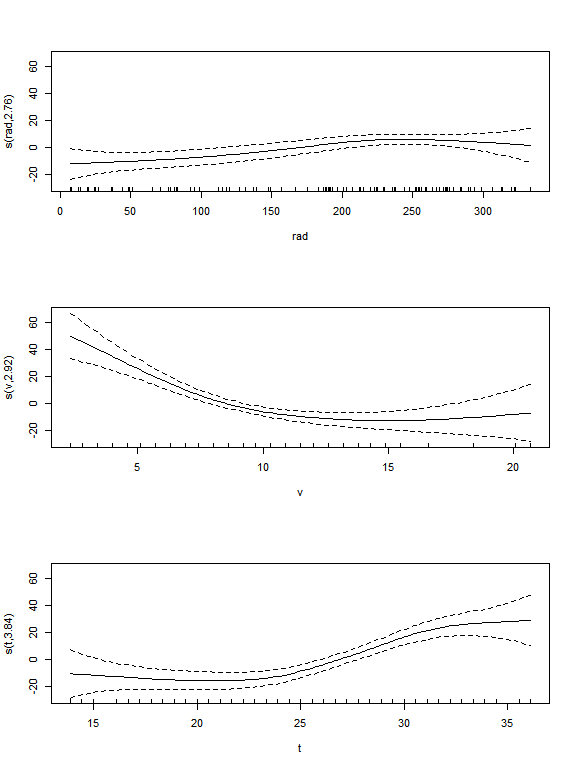

Modelación Lineal
================

## Tabla de contenido

  - [Introducción](#introducción)
  - [Metodología](#metodología)
  - [Variables aleatorias](#variables-aleatorias)
  - [Modelo no lineal](#modelo-no-lineal)
  - [Modelos con variables dummy](#modelos-con-variables-dummy)
  - [Polución del aire](#polución-del-aire)
      - [Selección del modelo](#selección-del-modelo)
  - [Modelos logísticos y múltiples](#modelos-logísticos-y-múltiples)
      - [Modelos logísticos](#modelos-logísticos)
      - [Modelos de regresión múltiple](#modelos-de-regresión-múltiple)
  - [Correlación y modelos para estimar
    volumen](#correlación-y-modelos-para-estimar-volumen)
  - [Distribuciones diamétricas](#distribuciones-diamétricas)
      - [Ajustes de una distribución](#ajustes-de-una-distribución)
      - [Distribución beta con los límites
        ajustados](#distribución-beta-con-los-límites-ajustados)
      - [Distribución binomial
        negativa](#distribución-binomial-negativa)
  - [Bibliografía](#bibliografía)

## Introducción

La modelación lineal consiste en tratar de explicar el comportamiento de
una variable aleatoria mediante su relación lineal con los valores de
otras que pueden influirla (Mendenhall, W.,1994); es decir, que puede
dar estimaciones o predicciones acerca de cómo será el comportamiento de
una variable que no conocemos y que es difícil de medir. Para esto, se
realizan regresiones con los datos observados y se analizan de manera
que se pueda establecer cuál es el mejor modelo que explica la variable
que queremos conocer.

El objetivo de este informe es demostrar la comprensión de los conceptos
teóricos de la modelación lineal aprendidos en el curso y aplicar dichos
conceptos con datos reales para realizar un análisis que nos permita,
concluir acerca del comportamiento de estos. Para el cumplimiento de
estos objetivos se utilizará el programa estadístico R-studio.

## Metodología

Para desarrollar los ejercicios propuestos en el curso se utilizó el
software libre R-Gui y la interfaz gráfica desarrollada para este,
R-studio; anterior a esto los datos eran dispuestos en Excel de tal
manera que pudieran ser manipulados con mayor facilidad en R. Para cada
uno de los puntos del taller se utilizó lo visto en las clases y junto
con los documentos de apoyo se desarrolló el trabajo y se interpretaron
los resultados.

De manera general, a cada uno de los modelos obtenidos durante el
desarrollo del trabajo se evaluaron teniendo en cuenta ciertos
criterios, que permiten saber si se ajustan de manera adecuada y si
permiten explicar de manera correcta las variables evaluadas; estos
criterios fueron la homocedasticidad, la distribución de los residuales
y el nivel de significancia de las variables utilizadas para hacer las
regresiones.

Teniendo en cuenta estos criterios, se ajustaron y se hicieron las
transformaciones correspondientes a cada uno de los modelos para obtener
los mejores resultados posibles en cada punto del taller. En algunos de
los ejercicios se realizaron pruebas de medias para evaluar si existían
diferencias significativas o no entre las variables evaluadas, las
pruebas empleadas fueron las que comúnmente se utilizan para variables
que se distribuyen de forma normal.

## Variables aleatorias

``` r
require(readxl)
require(pander)
require(kableExtra)
library(sjPlot)
library(sjmisc)
library(sjlabelled)
```

Se crearon las variables aleatorias normales, **altura(y), DAP(x1),
densidad(x2), ramas(x3)**. Para las cuales se buscaba ajustar un modelo
lineal con los siguientes datos. Se esperaba no tener un buen ajuste de
las variables independientes debido a que fueron escogidas
aleatoriamente. En otras palabras no se podra explicar la variable Y en
términos de x1, x2 o x3.

``` r
set.seed(1)
y<-rnorm(15, 4,1.1) #Altura
x1<-rnorm(15,15,2)  #DAP
x2<-rnorm(15,0.5,.3) #Densidad
x3<-rnorm(15, 62.4,7) #Ramas
mod<-lm(y~x1+x2+x3)
```

Efectivamente, las variables independientes no fueron significativas.
Por lo que se procede a ordenar de las variables y, x1 y x3, con el fin
de que estas variables sean significativas para un modelo lineal.

``` r
tab_model(mod, title = "Resumen del modelo con las variables aletorias")
```

<table style="border-collapse:collapse; border:none;">

<caption style="font-weight: bold; text-align:left;">

Resumen del modelo con las variables aletorias

</caption>

<tr>

<th style="border-top: double; text-align:center; font-style:normal; font-weight:bold; padding:0.2cm;  text-align:left; ">

 

</th>

<th colspan="3" style="border-top: double; text-align:center; font-style:normal; font-weight:bold; padding:0.2cm; ">

y

</th>

</tr>

<tr>

<td style=" text-align:center; border-bottom:1px solid; font-style:italic; font-weight:normal;  text-align:left; ">

Predictors

</td>

<td style=" text-align:center; border-bottom:1px solid; font-style:italic; font-weight:normal;  ">

Estimates

</td>

<td style=" text-align:center; border-bottom:1px solid; font-style:italic; font-weight:normal;  ">

CI

</td>

<td style=" text-align:center; border-bottom:1px solid; font-style:italic; font-weight:normal;  ">

p

</td>

</tr>

<tr>

<td style=" padding:0.2cm; text-align:left; vertical-align:top; text-align:left; ">

(Intercept)

</td>

<td style=" padding:0.2cm; text-align:left; vertical-align:top; text-align:center;  ">

7.41

</td>

<td style=" padding:0.2cm; text-align:left; vertical-align:top; text-align:center;  ">

\-2.18 – 17.00

</td>

<td style=" padding:0.2cm; text-align:left; vertical-align:top; text-align:center;  ">

0.117

</td>

</tr>

<tr>

<td style=" padding:0.2cm; text-align:left; vertical-align:top; text-align:left; ">

x1

</td>

<td style=" padding:0.2cm; text-align:left; vertical-align:top; text-align:center;  ">

\-0.08

</td>

<td style=" padding:0.2cm; text-align:left; vertical-align:top; text-align:center;  ">

\-0.59 – 0.43

</td>

<td style=" padding:0.2cm; text-align:left; vertical-align:top; text-align:center;  ">

0.736

</td>

</tr>

<tr>

<td style=" padding:0.2cm; text-align:left; vertical-align:top; text-align:left; ">

x2

</td>

<td style=" padding:0.2cm; text-align:left; vertical-align:top; text-align:center;  ">

\-2.54

</td>

<td style=" padding:0.2cm; text-align:left; vertical-align:top; text-align:center;  ">

\-6.21 – 1.14

</td>

<td style=" padding:0.2cm; text-align:left; vertical-align:top; text-align:center;  ">

0.157

</td>

</tr>

<tr>

<td style=" padding:0.2cm; text-align:left; vertical-align:top; text-align:left; ">

x3

</td>

<td style=" padding:0.2cm; text-align:left; vertical-align:top; text-align:center;  ">

\-0.01

</td>

<td style=" padding:0.2cm; text-align:left; vertical-align:top; text-align:center;  ">

\-0.14 – 0.11

</td>

<td style=" padding:0.2cm; text-align:left; vertical-align:top; text-align:center;  ">

0.837

</td>

</tr>

<tr>

<td style=" padding:0.2cm; text-align:left; vertical-align:top; text-align:left; padding-top:0.1cm; padding-bottom:0.1cm; border-top:1px solid;">

Observations

</td>

<td style=" padding:0.2cm; text-align:left; vertical-align:top; padding-top:0.1cm; padding-bottom:0.1cm; text-align:left; border-top:1px solid;" colspan="3">

15

</td>

</tr>

<tr>

<td style=" padding:0.2cm; text-align:left; vertical-align:top; text-align:left; padding-top:0.1cm; padding-bottom:0.1cm;">

R<sup>2</sup> / R<sup>2</sup> adjusted

</td>

<td style=" padding:0.2cm; text-align:left; vertical-align:top; padding-top:0.1cm; padding-bottom:0.1cm; text-align:left;" colspan="3">

0.183 / -0.039

</td>

</tr>

</table>

``` r
y<-sort(y)
x1<-sort(x1)  
x3<-sort(x3)
mod1<-lm(y~x1+x2+x3)
```

Como se esperaba, las varibles que se ordenaron (x1,x2) fueron
significativas al 5%, además de la significancia del intercepto. Ademas
de que el valor del \(R^2\), incremento con respecto al modelo anterior,
donde las varables estaban en desorden.

``` r
tab_model(mod1, title = "Resumen del modelo con las variables ordenadas")
```

<table style="border-collapse:collapse; border:none;">

<caption style="font-weight: bold; text-align:left;">

Resumen del modelo con las variables ordenadas

</caption>

<tr>

<th style="border-top: double; text-align:center; font-style:normal; font-weight:bold; padding:0.2cm;  text-align:left; ">

 

</th>

<th colspan="3" style="border-top: double; text-align:center; font-style:normal; font-weight:bold; padding:0.2cm; ">

y

</th>

</tr>

<tr>

<td style=" text-align:center; border-bottom:1px solid; font-style:italic; font-weight:normal;  text-align:left; ">

Predictors

</td>

<td style=" text-align:center; border-bottom:1px solid; font-style:italic; font-weight:normal;  ">

Estimates

</td>

<td style=" text-align:center; border-bottom:1px solid; font-style:italic; font-weight:normal;  ">

CI

</td>

<td style=" text-align:center; border-bottom:1px solid; font-style:italic; font-weight:normal;  ">

p

</td>

</tr>

<tr>

<td style=" padding:0.2cm; text-align:left; vertical-align:top; text-align:left; ">

(Intercept)

</td>

<td style=" padding:0.2cm; text-align:left; vertical-align:top; text-align:center;  ">

\-6.67

</td>

<td style=" padding:0.2cm; text-align:left; vertical-align:top; text-align:center;  ">

\-8.70 – -4.64

</td>

<td style=" padding:0.2cm; text-align:left; vertical-align:top; text-align:center;  ">

<strong>\<0.001

</td>

</tr>

<tr>

<td style=" padding:0.2cm; text-align:left; vertical-align:top; text-align:left; ">

x1

</td>

<td style=" padding:0.2cm; text-align:left; vertical-align:top; text-align:center;  ">

0.27

</td>

<td style=" padding:0.2cm; text-align:left; vertical-align:top; text-align:center;  ">

0.03 – 0.50

</td>

<td style=" padding:0.2cm; text-align:left; vertical-align:top; text-align:center;  ">

<strong>0.029</strong>

</td>

</tr>

<tr>

<td style=" padding:0.2cm; text-align:left; vertical-align:top; text-align:left; ">

x2

</td>

<td style=" padding:0.2cm; text-align:left; vertical-align:top; text-align:center;  ">

\-0.01

</td>

<td style=" padding:0.2cm; text-align:left; vertical-align:top; text-align:center;  ">

\-0.90 – 0.88

</td>

<td style=" padding:0.2cm; text-align:left; vertical-align:top; text-align:center;  ">

0.984

</td>

</tr>

<tr>

<td style=" padding:0.2cm; text-align:left; vertical-align:top; text-align:left; ">

x3

</td>

<td style=" padding:0.2cm; text-align:left; vertical-align:top; text-align:center;  ">

0.11

</td>

<td style=" padding:0.2cm; text-align:left; vertical-align:top; text-align:center;  ">

0.04 – 0.17

</td>

<td style=" padding:0.2cm; text-align:left; vertical-align:top; text-align:center;  ">

<strong>0.004</strong>

</td>

</tr>

<tr>

<td style=" padding:0.2cm; text-align:left; vertical-align:top; text-align:left; padding-top:0.1cm; padding-bottom:0.1cm; border-top:1px solid;">

Observations

</td>

<td style=" padding:0.2cm; text-align:left; vertical-align:top; padding-top:0.1cm; padding-bottom:0.1cm; text-align:left; border-top:1px solid;" colspan="3">

15

</td>

</tr>

<tr>

<td style=" padding:0.2cm; text-align:left; vertical-align:top; text-align:left; padding-top:0.1cm; padding-bottom:0.1cm;">

R<sup>2</sup> / R<sup>2</sup> adjusted

</td>

<td style=" padding:0.2cm; text-align:left; vertical-align:top; padding-top:0.1cm; padding-bottom:0.1cm; text-align:left;" colspan="3">

0.937 / 0.919

</td>

</tr>

</table>

## Modelo no lineal

Se cargo la base de datos lola, donde se busco explicar la edad de
cuervos en función de la longitud de las alas. Siguiendo un modelo no
lineal \(y=a+be^{-cx}\). Con el fin de obtener los parámetros iniciales,
se gráfico a partir de valores cercanos al calculo para valores de x
cuando es cero e infinito. Además como la regresión no linela se ajusta
por medio de iteraciones con el fin de disminuir el error de Taylor, los
valores iniciales no necesariamente tienen que ser muy exactos.

``` r
datos= read_xlsx("lola.xlsx", sheet = "Hoja1")
mod<-nls(y~a-b*exp(-c*x),start=list(a=25,b=24,c=1.5),data=datos)
tab_model(mod, title="Resumen del modelo no lineal", show.r2 = F)
```

<table style="border-collapse:collapse; border:none;">

<caption style="font-weight: bold; text-align:left;">

Resumen del modelo no lineal

</caption>

<tr>

<th style="border-top: double; text-align:center; font-style:normal; font-weight:bold; padding:0.2cm;  text-align:left; ">

 

</th>

<th colspan="3" style="border-top: double; text-align:center; font-style:normal; font-weight:bold; padding:0.2cm; ">

Dependent variable

</th>

</tr>

<tr>

<td style=" text-align:center; border-bottom:1px solid; font-style:italic; font-weight:normal;  text-align:left; ">

Predictors

</td>

<td style=" text-align:center; border-bottom:1px solid; font-style:italic; font-weight:normal;  ">

Estimates

</td>

<td style=" text-align:center; border-bottom:1px solid; font-style:italic; font-weight:normal;  ">

CI

</td>

<td style=" text-align:center; border-bottom:1px solid; font-style:italic; font-weight:normal;  ">

p

</td>

</tr>

<tr>

<td style=" padding:0.2cm; text-align:left; vertical-align:top; text-align:left; ">

a

</td>

<td style=" padding:0.2cm; text-align:left; vertical-align:top; text-align:center;  ">

23.05

</td>

<td style=" padding:0.2cm; text-align:left; vertical-align:top; text-align:center;  ">

21.91 – 24.19

</td>

<td style=" padding:0.2cm; text-align:left; vertical-align:top; text-align:center;  ">

<strong>\<0.001

</td>

</tr>

<tr>

<td style=" padding:0.2cm; text-align:left; vertical-align:top; text-align:left; ">

b

</td>

<td style=" padding:0.2cm; text-align:left; vertical-align:top; text-align:center;  ">

23.74

</td>

<td style=" padding:0.2cm; text-align:left; vertical-align:top; text-align:center;  ">

20.64 – 26.83

</td>

<td style=" padding:0.2cm; text-align:left; vertical-align:top; text-align:center;  ">

<strong>\<0.001

</td>

</tr>

<tr>

<td style=" padding:0.2cm; text-align:left; vertical-align:top; text-align:left; ">

c

</td>

<td style=" padding:0.2cm; text-align:left; vertical-align:top; text-align:center;  ">

0.62

</td>

<td style=" padding:0.2cm; text-align:left; vertical-align:top; text-align:center;  ">

0.45 – 0.79

</td>

<td style=" padding:0.2cm; text-align:left; vertical-align:top; text-align:center;  ">

<strong>\<0.001

</td>

</tr>

<tr>

<td style=" padding:0.2cm; text-align:left; vertical-align:top; text-align:left; padding-top:0.1cm; padding-bottom:0.1cm; border-top:1px solid;">

Observations

</td>

<td style=" padding:0.2cm; text-align:left; vertical-align:top; padding-top:0.1cm; padding-bottom:0.1cm; text-align:left; border-top:1px solid;" colspan="3">

54

</td>

</tr>

</table>

``` r
sm=summary(mod)
coe<-coefficients(mod)
t=qt(0.975,53)
m=sm$parameters
param=matrix
r1=m[1,1]+c(-1,1)*t*m[1,2]
r2=m[2,1]+c(-1,1)*t*m[2,2]
r3=m[3,1]+c(-1,1)*t*m[3,2]
p=cbind(m[,1],rbind(r1,r2,r3))
colnames(p)=c("Estimado", "Límite inferrior", "Límite superior")
```

``` r
kable(p, caption = "Intervalos de confianza y estimadores de lo parámetros no lineales del modelo")
```

<table>

<caption>

Intervalos de confianza y estimadores de lo parámetros no lineales del
modelo

</caption>

<thead>

<tr>

<th style="text-align:left;">

</th>

<th style="text-align:right;">

Estimado

</th>

<th style="text-align:right;">

Límite inferrior

</th>

<th style="text-align:right;">

Límite superior

</th>

</tr>

</thead>

<tbody>

<tr>

<td style="text-align:left;">

a

</td>

<td style="text-align:right;">

23.0505291

</td>

<td style="text-align:right;">

21.8816212

</td>

<td style="text-align:right;">

24.2194369

</td>

</tr>

<tr>

<td style="text-align:left;">

b

</td>

<td style="text-align:right;">

23.7375397

</td>

<td style="text-align:right;">

20.5714550

</td>

<td style="text-align:right;">

26.9036244

</td>

</tr>

<tr>

<td style="text-align:left;">

c

</td>

<td style="text-align:right;">

0.6175297

</td>

<td style="text-align:right;">

0.4459886

</td>

<td style="text-align:right;">

0.7890709

</td>

</tr>

</tbody>

</table>

``` r
{
  with(datos,plot(x,y,ylim=c(0,30),xlim=c(0,10), ylab="Edad(años)",xlab="Longitud de las alas(cm)"))
  par(new=T)
  curve(coe[1]-coe[2]*exp(-coe[3]*x),ylim=c(0,30),xlim=c(0,10),xlab = "",
        ylab = "", axes=F, col="red")
  par(new=T)
  curve(25-24*exp(-1.5*x),ylim=c(0,30),xlim=c(0,10),xlab = "",ylab = "",axes=F,col="blue")
}
```


## Modelos con variables *dummy*

A partir de una base de datos proporcionada con dieciocho observaciones
y cinco variables se realizó un análisis de variables condicionales para
modelar la edad (E) en función del número de anillos de crecimiento (N)
de los árboles y el sitio de crecimiento (lugar).

Los sitios se diferenciaron utilizando variables dummy (p1 y p2), que
mediante combinaciones de ceros y unos permiten diferenciar mediante
variables cuantitativas cada lugar y de esta manera poder realizar
modelaciones. Antes de evaluar modelos para calcular la edad se creó una
nueva variable; el número de anillos elevado al cuadrado \(N^2\). Se
estimaron diferentes modelos lineales empezando con un modelo pleno y se
fueron eliminando variables de acuerdo al nivel de significancia de
estas, finalmente se ajustó un modelo que explica la edad en función del
número de anillos (N) y la variable dummy (p2). El modelo es el
siguiente: \(E=1.39816 + 1.02510N - 2.76098p2\)

``` r
datos<-read.csv2("Anillos.csv")
datos$lugar=as.factor(datos$lugar)
kable(head(datos))
```

<table>

<thead>

<tr>

<th style="text-align:right;">

N

</th>

<th style="text-align:right;">

E

</th>

<th style="text-align:left;">

lugar

</th>

<th style="text-align:right;">

p1

</th>

<th style="text-align:right;">

p2

</th>

<th style="text-align:right;">

p3

</th>

</tr>

</thead>

<tbody>

<tr>

<td style="text-align:right;">

8.0

</td>

<td style="text-align:right;">

8.8

</td>

<td style="text-align:left;">

PB

</td>

<td style="text-align:right;">

0

</td>

<td style="text-align:right;">

0

</td>

<td style="text-align:right;">

1

</td>

</tr>

<tr>

<td style="text-align:right;">

9.2

</td>

<td style="text-align:right;">

11.2

</td>

<td style="text-align:left;">

PB

</td>

<td style="text-align:right;">

0

</td>

<td style="text-align:right;">

0

</td>

<td style="text-align:right;">

1

</td>

</tr>

<tr>

<td style="text-align:right;">

10.6

</td>

<td style="text-align:right;">

12.0

</td>

<td style="text-align:left;">

PB

</td>

<td style="text-align:right;">

0

</td>

<td style="text-align:right;">

0

</td>

<td style="text-align:right;">

1

</td>

</tr>

<tr>

<td style="text-align:right;">

12.0

</td>

<td style="text-align:right;">

14.4

</td>

<td style="text-align:left;">

PB

</td>

<td style="text-align:right;">

0

</td>

<td style="text-align:right;">

0

</td>

<td style="text-align:right;">

1

</td>

</tr>

<tr>

<td style="text-align:right;">

14.4

</td>

<td style="text-align:right;">

16.8

</td>

<td style="text-align:left;">

PB

</td>

<td style="text-align:right;">

0

</td>

<td style="text-align:right;">

0

</td>

<td style="text-align:right;">

1

</td>

</tr>

<tr>

<td style="text-align:right;">

20.0

</td>

<td style="text-align:right;">

21.2

</td>

<td style="text-align:left;">

PB

</td>

<td style="text-align:right;">

0

</td>

<td style="text-align:right;">

0

</td>

<td style="text-align:right;">

1

</td>

</tr>

</tbody>

</table>

Los estimados obtenidos en el modelo pleno para p1 y p2 son
respectivamente 0.02016 y-2.77281, que uno de los dos no de
significativo implica que hay dos sitios que no existen diferencias
entre dos sitios.

``` r
mod1=lm(E~N+I(N^2)+p1+p2,datos) #Modelo pleno
tab_model(mod1, title = "Resumen del modelo pleno (modelo 1)")
```

<table style="border-collapse:collapse; border:none;">

<caption style="font-weight: bold; text-align:left;">

Resumen del modelo pleno (modelo 1)

</caption>

<tr>

<th style="border-top: double; text-align:center; font-style:normal; font-weight:bold; padding:0.2cm;  text-align:left; ">

 

</th>

<th colspan="3" style="border-top: double; text-align:center; font-style:normal; font-weight:bold; padding:0.2cm; ">

E

</th>

</tr>

<tr>

<td style=" text-align:center; border-bottom:1px solid; font-style:italic; font-weight:normal;  text-align:left; ">

Predictors

</td>

<td style=" text-align:center; border-bottom:1px solid; font-style:italic; font-weight:normal;  ">

Estimates

</td>

<td style=" text-align:center; border-bottom:1px solid; font-style:italic; font-weight:normal;  ">

CI

</td>

<td style=" text-align:center; border-bottom:1px solid; font-style:italic; font-weight:normal;  ">

p

</td>

</tr>

<tr>

<td style=" padding:0.2cm; text-align:left; vertical-align:top; text-align:left; ">

(Intercept)

</td>

<td style=" padding:0.2cm; text-align:left; vertical-align:top; text-align:center;  ">

\-0.72

</td>

<td style=" padding:0.2cm; text-align:left; vertical-align:top; text-align:center;  ">

\-4.61 – 3.16

</td>

<td style=" padding:0.2cm; text-align:left; vertical-align:top; text-align:center;  ">

0.690

</td>

</tr>

<tr>

<td style=" padding:0.2cm; text-align:left; vertical-align:top; text-align:left; ">

N

</td>

<td style=" padding:0.2cm; text-align:left; vertical-align:top; text-align:center;  ">

1.41

</td>

<td style=" padding:0.2cm; text-align:left; vertical-align:top; text-align:center;  ">

0.77 – 2.05

</td>

<td style=" padding:0.2cm; text-align:left; vertical-align:top; text-align:center;  ">

<strong>0.001</strong>

</td>

</tr>

<tr>

<td style=" padding:0.2cm; text-align:left; vertical-align:top; text-align:left; ">

N^2

</td>

<td style=" padding:0.2cm; text-align:left; vertical-align:top; text-align:center;  ">

\-0.02

</td>

<td style=" padding:0.2cm; text-align:left; vertical-align:top; text-align:center;  ">

\-0.04 – 0.01

</td>

<td style=" padding:0.2cm; text-align:left; vertical-align:top; text-align:center;  ">

0.204

</td>

</tr>

<tr>

<td style=" padding:0.2cm; text-align:left; vertical-align:top; text-align:left; ">

p1

</td>

<td style=" padding:0.2cm; text-align:left; vertical-align:top; text-align:center;  ">

0.16

</td>

<td style=" padding:0.2cm; text-align:left; vertical-align:top; text-align:center;  ">

\-1.09 – 1.42

</td>

<td style=" padding:0.2cm; text-align:left; vertical-align:top; text-align:center;  ">

0.780

</td>

</tr>

<tr>

<td style=" padding:0.2cm; text-align:left; vertical-align:top; text-align:left; ">

p2

</td>

<td style=" padding:0.2cm; text-align:left; vertical-align:top; text-align:center;  ">

\-3.06

</td>

<td style=" padding:0.2cm; text-align:left; vertical-align:top; text-align:center;  ">

\-4.44 – -1.68

</td>

<td style=" padding:0.2cm; text-align:left; vertical-align:top; text-align:center;  ">

<strong>\<0.001

</td>

</tr>

<tr>

<td style=" padding:0.2cm; text-align:left; vertical-align:top; text-align:left; padding-top:0.1cm; padding-bottom:0.1cm; border-top:1px solid;">

Observations

</td>

<td style=" padding:0.2cm; text-align:left; vertical-align:top; padding-top:0.1cm; padding-bottom:0.1cm; text-align:left; border-top:1px solid;" colspan="3">

16

</td>

</tr>

<tr>

<td style=" padding:0.2cm; text-align:left; vertical-align:top; text-align:left; padding-top:0.1cm; padding-bottom:0.1cm;">

R<sup>2</sup> / R<sup>2</sup> adjusted

</td>

<td style=" padding:0.2cm; text-align:left; vertical-align:top; padding-top:0.1cm; padding-bottom:0.1cm; text-align:left;" colspan="3">

0.967 / 0.955

</td>

</tr>

</table>

``` r
mod2<-lm(E~N+p1+p2,datos)
mod3<-lm(E~N+I(N^2)+p2,datos)
mod4<-lm(E~N+p2,datos) #Modelo con mejores estimadores
tab_model(mod4, title = "Resumen del modelo con mayor ajuste (modelo 4)")
```

<table style="border-collapse:collapse; border:none;">

<caption style="font-weight: bold; text-align:left;">

Resumen del modelo con mayor ajuste (modelo 4)

</caption>

<tr>

<th style="border-top: double; text-align:center; font-style:normal; font-weight:bold; padding:0.2cm;  text-align:left; ">

 

</th>

<th colspan="3" style="border-top: double; text-align:center; font-style:normal; font-weight:bold; padding:0.2cm; ">

E

</th>

</tr>

<tr>

<td style=" text-align:center; border-bottom:1px solid; font-style:italic; font-weight:normal;  text-align:left; ">

Predictors

</td>

<td style=" text-align:center; border-bottom:1px solid; font-style:italic; font-weight:normal;  ">

Estimates

</td>

<td style=" text-align:center; border-bottom:1px solid; font-style:italic; font-weight:normal;  ">

CI

</td>

<td style=" text-align:center; border-bottom:1px solid; font-style:italic; font-weight:normal;  ">

p

</td>

</tr>

<tr>

<td style=" padding:0.2cm; text-align:left; vertical-align:top; text-align:left; ">

(Intercept)

</td>

<td style=" padding:0.2cm; text-align:left; vertical-align:top; text-align:center;  ">

1.40

</td>

<td style=" padding:0.2cm; text-align:left; vertical-align:top; text-align:center;  ">

\-0.11 – 2.91

</td>

<td style=" padding:0.2cm; text-align:left; vertical-align:top; text-align:center;  ">

0.067

</td>

</tr>

<tr>

<td style=" padding:0.2cm; text-align:left; vertical-align:top; text-align:left; ">

N

</td>

<td style=" padding:0.2cm; text-align:left; vertical-align:top; text-align:center;  ">

1.03

</td>

<td style=" padding:0.2cm; text-align:left; vertical-align:top; text-align:center;  ">

0.90 – 1.15

</td>

<td style=" padding:0.2cm; text-align:left; vertical-align:top; text-align:center;  ">

<strong>\<0.001

</td>

</tr>

<tr>

<td style=" padding:0.2cm; text-align:left; vertical-align:top; text-align:left; ">

p2

</td>

<td style=" padding:0.2cm; text-align:left; vertical-align:top; text-align:center;  ">

\-2.76

</td>

<td style=" padding:0.2cm; text-align:left; vertical-align:top; text-align:center;  ">

\-3.81 – -1.71

</td>

<td style=" padding:0.2cm; text-align:left; vertical-align:top; text-align:center;  ">

<strong>\<0.001

</td>

</tr>

<tr>

<td style=" padding:0.2cm; text-align:left; vertical-align:top; text-align:left; padding-top:0.1cm; padding-bottom:0.1cm; border-top:1px solid;">

Observations

</td>

<td style=" padding:0.2cm; text-align:left; vertical-align:top; padding-top:0.1cm; padding-bottom:0.1cm; text-align:left; border-top:1px solid;" colspan="3">

16

</td>

</tr>

<tr>

<td style=" padding:0.2cm; text-align:left; vertical-align:top; text-align:left; padding-top:0.1cm; padding-bottom:0.1cm;">

R<sup>2</sup> / R<sup>2</sup> adjusted

</td>

<td style=" padding:0.2cm; text-align:left; vertical-align:top; padding-top:0.1cm; padding-bottom:0.1cm; text-align:left;" colspan="3">

0.962 / 0.956

</td>

</tr>

</table>

``` r
mod2<-lm(E~N+p1+p2,datos)
summary(mod2)
mod3<-lm(E~N+I(N^2)+p2,datos)
summary(mod3)
mod4<-lm(E~N+p2,datos)
summary(mod4)
mod5<-lm(E~N+lugar,datos)
summary(mod5)
anova(mod5)
mod6<-lm(E~N+p1+p3,datos)
summary(mod6)
mod7<-lm(E~I(N^2)+p2,datos)
summary(mod7)
```

Este modelo presenta un \(R^2\) de 0.96 y las variables utilizadas
explican plenamente la edad.

Para probar otras estimaciones se creó una nueva variable *dummy* (p3)
que remplazaba la variable p2, aun así esta variable se comportaba
exactamente igual a la variable p1, por tanto no se modificó el modelo
seleccionado.

``` r
mod6<-lm(E~N+p1+p3,datos)
tab_model(mod6, title = "Resumen del modelo 6 donde con las variables dummy p1 y p3)")
```

<table style="border-collapse:collapse; border:none;">

<caption style="font-weight: bold; text-align:left;">

Resumen del modelo 6 donde con las variables dummy p1 y p3)

</caption>

<tr>

<th style="border-top: double; text-align:center; font-style:normal; font-weight:bold; padding:0.2cm;  text-align:left; ">

 

</th>

<th colspan="3" style="border-top: double; text-align:center; font-style:normal; font-weight:bold; padding:0.2cm; ">

E

</th>

</tr>

<tr>

<td style=" text-align:center; border-bottom:1px solid; font-style:italic; font-weight:normal;  text-align:left; ">

Predictors

</td>

<td style=" text-align:center; border-bottom:1px solid; font-style:italic; font-weight:normal;  ">

Estimates

</td>

<td style=" text-align:center; border-bottom:1px solid; font-style:italic; font-weight:normal;  ">

CI

</td>

<td style=" text-align:center; border-bottom:1px solid; font-style:italic; font-weight:normal;  ">

p

</td>

</tr>

<tr>

<td style=" padding:0.2cm; text-align:left; vertical-align:top; text-align:left; ">

(Intercept)

</td>

<td style=" padding:0.2cm; text-align:left; vertical-align:top; text-align:center;  ">

4.16

</td>

<td style=" padding:0.2cm; text-align:left; vertical-align:top; text-align:center;  ">

2.17 – 6.14

</td>

<td style=" padding:0.2cm; text-align:left; vertical-align:top; text-align:center;  ">

<strong>0.001</strong>

</td>

</tr>

<tr>

<td style=" padding:0.2cm; text-align:left; vertical-align:top; text-align:left; ">

N

</td>

<td style=" padding:0.2cm; text-align:left; vertical-align:top; text-align:center;  ">

1.03

</td>

<td style=" padding:0.2cm; text-align:left; vertical-align:top; text-align:center;  ">

0.89 – 1.16

</td>

<td style=" padding:0.2cm; text-align:left; vertical-align:top; text-align:center;  ">

<strong>\<0.001

</td>

</tr>

<tr>

<td style=" padding:0.2cm; text-align:left; vertical-align:top; text-align:left; ">

p1

</td>

<td style=" padding:0.2cm; text-align:left; vertical-align:top; text-align:center;  ">

\-2.75

</td>

<td style=" padding:0.2cm; text-align:left; vertical-align:top; text-align:center;  ">

\-3.98 – -1.53

</td>

<td style=" padding:0.2cm; text-align:left; vertical-align:top; text-align:center;  ">

<strong>\<0.001

</td>

</tr>

<tr>

<td style=" padding:0.2cm; text-align:left; vertical-align:top; text-align:left; ">

p3

</td>

<td style=" padding:0.2cm; text-align:left; vertical-align:top; text-align:center;  ">

\-2.77

</td>

<td style=" padding:0.2cm; text-align:left; vertical-align:top; text-align:center;  ">

\-4.10 – -1.44

</td>

<td style=" padding:0.2cm; text-align:left; vertical-align:top; text-align:center;  ">

<strong>0.001</strong>

</td>

</tr>

<tr>

<td style=" padding:0.2cm; text-align:left; vertical-align:top; text-align:left; padding-top:0.1cm; padding-bottom:0.1cm; border-top:1px solid;">

Observations

</td>

<td style=" padding:0.2cm; text-align:left; vertical-align:top; padding-top:0.1cm; padding-bottom:0.1cm; text-align:left; border-top:1px solid;" colspan="3">

16

</td>

</tr>

<tr>

<td style=" padding:0.2cm; text-align:left; vertical-align:top; text-align:left; padding-top:0.1cm; padding-bottom:0.1cm;">

R<sup>2</sup> / R<sup>2</sup> adjusted

</td>

<td style=" padding:0.2cm; text-align:left; vertical-align:top; padding-top:0.1cm; padding-bottom:0.1cm; text-align:left;" colspan="3">

0.962 / 0.952

</td>

</tr>

</table>

Una vez elegido el modelo se calculó la edad estimada (E2) para cada
sitio evaluado. Con estos datos se realizaron pruebas de medias que
permitieran probar si existían diferencias significativas o no entre los
sitios evaluados. Las pruebas aplicadas fueron t de students y el test
de wilcoxon.

A partir de ambas pruebas y analizando los valores de P de 0.9562 y de 1
respectivamente, se puede decir que existen diferencias significativas
entre el sitio cauca y santa rosa. Mientras que no se puede rechazar la
hipótesis nula de las pruebas entre Piedras Blancas-Cauca y Piedras
Blancas -Santa Rosa.

## Polución del aire

``` r
datos<-read.csv2("polucion.csv",dec = ".")
library(mgcv)
```

    ## Loading required package: nlme

    ## This is mgcv 1.8-31. For overview type 'help("mgcv-package")'.

``` r
library(tree)
```

    ## Registered S3 method overwritten by 'tree':
    ##   method     from
    ##   print.tree cli

Se define la concentración de ozono (oz), como la variable dependiente
de: la radiación solar (rad), velocidad del viento (v) y temperatura
(t).

En primera instancia, al comparar la concentración de ozono, con las
variables intependientes, se aprecia que las variables siguen un
comportamiento no lineal. Siendo la relación entre ozono y temperatura
la que mayor ajuste presenta, seguido de por la relación con la
ozono-velocidad.

Por otro lado, la relación entre la velocidad y temperatura, es
proporcionalmente inversa, es decir, a mayor temperatura menor velocidad
del viento. También se presenta una relación proporcional entre la
radiación y la temperatura. Sin embargo la relación en forma
inversa(temperatura-radiación) no es proporcional.

``` r
pairs(datos,panel=panel.smooth)
```


Teniendo en cuenta la relación entre las variables, la temperatura sería
la varible que mejor se ajuste a un modelo lineal simple, ya que, es la
varible es la mas fácil de medir, y ademas presenta mayor correlación
con la variable dependiente, con un valor de 0.698.

``` r
kable(cor(datos), caption = "Matrix de correlación entre las variables")
```

<table>

<caption>

Matrix de correlación entre las variables

</caption>

<thead>

<tr>

<th style="text-align:left;">

</th>

<th style="text-align:right;">

rad

</th>

<th style="text-align:right;">

v

</th>

<th style="text-align:right;">

oz

</th>

<th style="text-align:right;">

t

</th>

</tr>

</thead>

<tbody>

<tr>

<td style="text-align:left;">

rad

</td>

<td style="text-align:right;">

1.0000000

</td>

<td style="text-align:right;">

\-0.1273656

</td>

<td style="text-align:right;">

0.3483417

</td>

<td style="text-align:right;">

0.2941175

</td>

</tr>

<tr>

<td style="text-align:left;">

v

</td>

<td style="text-align:right;">

\-0.1273656

</td>

<td style="text-align:right;">

1.0000000

</td>

<td style="text-align:right;">

\-0.6129508

</td>

<td style="text-align:right;">

\-0.4971439

</td>

</tr>

<tr>

<td style="text-align:left;">

oz

</td>

<td style="text-align:right;">

0.3483417

</td>

<td style="text-align:right;">

\-0.6129508

</td>

<td style="text-align:right;">

1.0000000

</td>

<td style="text-align:right;">

0.6984722

</td>

</tr>

<tr>

<td style="text-align:left;">

t

</td>

<td style="text-align:right;">

0.2941175

</td>

<td style="text-align:right;">

\-0.4971439

</td>

<td style="text-align:right;">

0.6984722

</td>

<td style="text-align:right;">

1.0000000

</td>

</tr>

</tbody>

</table>

``` r
msuave<-gam(oz~s(rad)+s(v)+s(t),data=datos)
summary(msuave)
```

    ## 
    ## Family: gaussian 
    ## Link function: identity 
    ## 
    ## Formula:
    ## oz ~ s(rad) + s(v) + s(t)
    ## 
    ## Parametric coefficients:
    ##             Estimate Std. Error t value Pr(>|t|)    
    ## (Intercept)    42.10       1.66   25.35   <2e-16 ***
    ## ---
    ## Signif. codes:  0 '***' 0.001 '**' 0.01 '*' 0.05 '.' 0.1 ' ' 1
    ## 
    ## Approximate significance of smooth terms:
    ##          edf Ref.df      F  p-value    
    ## s(rad) 2.763  3.451  3.965  0.00849 ** 
    ## s(v)   2.918  3.666 13.772 1.39e-08 ***
    ## s(t)   3.838  4.759 11.611 8.30e-09 ***
    ## ---
    ## Signif. codes:  0 '***' 0.001 '**' 0.01 '*' 0.05 '.' 0.1 ' ' 1
    ## 
    ## R-sq.(adj) =  0.724   Deviance explained = 74.8%
    ## GCV = 338.08  Scale est. = 306.05    n = 111

En la figura 2, los intervalos de confianza no son homogeneos alrededor
de la linea del modelo, lo que indica que las varianzas son distintas lo
que sugiere que hay heterocedasticidad. Por otro lado, la variabilidad
de los datos en los extremos es mayor que en la parte central.

``` r
{
  par(mfrow=c(3,1))
  plot(msuave)
}
```

 El
dendrograma, muestra que la variable de temperatura es la que mejor
explica la concentración de ozono, lo que ratifica lo expresado en el
punto anterior, en la que esta variable se escogio para desarrollar un
modelo lineal simple. También la otra variable que puede explicar la
concentración del ozono es la velocidad del viento. Se presentan dos
escenarios a partir del valor de la temperatura de 28.055; en los cuales
se evidencia, que con valores superiores a 28.055 se encuentran mayores
concentraciones de ozono. Posteriormente, se presentan 4 escenarios de
la velocidad del viento. Por otro lado, la variable de radición solar no
tiene mayor influencia para explicar la variable dependiente.

``` r
mtree<-tree(oz~., data = datos)
```

``` r
{
  par(mfrow=c(1,1))
  plot(mtree)
  text(mtree)
}
```


### Selección del modelo

``` r
mpleno<-lm(oz~t*v*rad+I(t^2)+I(v^2)+I(rad^2), datos) #Modelo Pleno
tab_model(mpleno, title = "Resumen del modelo completo")
```

<table style="border-collapse:collapse; border:none;">

<caption style="font-weight: bold; text-align:left;">

Resumen del modelo completo

</caption>

<tr>

<th style="border-top: double; text-align:center; font-style:normal; font-weight:bold; padding:0.2cm;  text-align:left; ">

 

</th>

<th colspan="3" style="border-top: double; text-align:center; font-style:normal; font-weight:bold; padding:0.2cm; ">

oz

</th>

</tr>

<tr>

<td style=" text-align:center; border-bottom:1px solid; font-style:italic; font-weight:normal;  text-align:left; ">

Predictors

</td>

<td style=" text-align:center; border-bottom:1px solid; font-style:italic; font-weight:normal;  ">

Estimates

</td>

<td style=" text-align:center; border-bottom:1px solid; font-style:italic; font-weight:normal;  ">

CI

</td>

<td style=" text-align:center; border-bottom:1px solid; font-style:italic; font-weight:normal;  ">

p

</td>

</tr>

<tr>

<td style=" padding:0.2cm; text-align:left; vertical-align:top; text-align:left; ">

(Intercept)

</td>

<td style=" padding:0.2cm; text-align:left; vertical-align:top; text-align:center;  ">

283.73

</td>

<td style=" padding:0.2cm; text-align:left; vertical-align:top; text-align:center;  ">

91.74 – 475.71

</td>

<td style=" padding:0.2cm; text-align:left; vertical-align:top; text-align:center;  ">

<strong>0.004</strong>

</td>

</tr>

<tr>

<td style=" padding:0.2cm; text-align:left; vertical-align:top; text-align:left; ">

t

</td>

<td style=" padding:0.2cm; text-align:left; vertical-align:top; text-align:center;  ">

\-12.65

</td>

<td style=" padding:0.2cm; text-align:left; vertical-align:top; text-align:center;  ">

\-23.07 – -2.22

</td>

<td style=" padding:0.2cm; text-align:left; vertical-align:top; text-align:center;  ">

<strong>0.018</strong>

</td>

</tr>

<tr>

<td style=" padding:0.2cm; text-align:left; vertical-align:top; text-align:left; ">

v

</td>

<td style=" padding:0.2cm; text-align:left; vertical-align:top; text-align:center;  ">

\-24.77

</td>

<td style=" padding:0.2cm; text-align:left; vertical-align:top; text-align:center;  ">

\-39.94 – -9.60

</td>

<td style=" padding:0.2cm; text-align:left; vertical-align:top; text-align:center;  ">

<strong>0.002</strong>

</td>

</tr>

<tr>

<td style=" padding:0.2cm; text-align:left; vertical-align:top; text-align:left; ">

rad

</td>

<td style=" padding:0.2cm; text-align:left; vertical-align:top; text-align:center;  ">

\-0.04

</td>

<td style=" padding:0.2cm; text-align:left; vertical-align:top; text-align:center;  ">

\-0.69 – 0.60

</td>

<td style=" padding:0.2cm; text-align:left; vertical-align:top; text-align:center;  ">

0.896

</td>

</tr>

<tr>

<td style=" padding:0.2cm; text-align:left; vertical-align:top; text-align:left; ">

t^2

</td>

<td style=" padding:0.2cm; text-align:left; vertical-align:top; text-align:center;  ">

0.19

</td>

<td style=" padding:0.2cm; text-align:left; vertical-align:top; text-align:center;  ">

0.03 – 0.34

</td>

<td style=" padding:0.2cm; text-align:left; vertical-align:top; text-align:center;  ">

<strong>0.017</strong>

</td>

</tr>

<tr>

<td style=" padding:0.2cm; text-align:left; vertical-align:top; text-align:left; ">

v^2

</td>

<td style=" padding:0.2cm; text-align:left; vertical-align:top; text-align:center;  ">

0.61

</td>

<td style=" padding:0.2cm; text-align:left; vertical-align:top; text-align:center;  ">

0.32 – 0.90

</td>

<td style=" padding:0.2cm; text-align:left; vertical-align:top; text-align:center;  ">

<strong>\<0.001

</td>

</tr>

<tr>

<td style=" padding:0.2cm; text-align:left; vertical-align:top; text-align:left; ">

rad^2

</td>

<td style=" padding:0.2cm; text-align:left; vertical-align:top; text-align:center;  ">

\-0.00

</td>

<td style=" padding:0.2cm; text-align:left; vertical-align:top; text-align:center;  ">

\-0.00 – 0.00

</td>

<td style=" padding:0.2cm; text-align:left; vertical-align:top; text-align:center;  ">

0.163

</td>

</tr>

<tr>

<td style=" padding:0.2cm; text-align:left; vertical-align:top; text-align:left; ">

t \* v

</td>

<td style=" padding:0.2cm; text-align:left; vertical-align:top; text-align:center;  ">

0.43

</td>

<td style=" padding:0.2cm; text-align:left; vertical-align:top; text-align:center;  ">

\-0.06 – 0.92

</td>

<td style=" padding:0.2cm; text-align:left; vertical-align:top; text-align:center;  ">

0.085

</td>

</tr>

<tr>

<td style=" padding:0.2cm; text-align:left; vertical-align:top; text-align:left; ">

t \* rad

</td>

<td style=" padding:0.2cm; text-align:left; vertical-align:top; text-align:center;  ">

0.02

</td>

<td style=" padding:0.2cm; text-align:left; vertical-align:top; text-align:center;  ">

\-0.01 – 0.04

</td>

<td style=" padding:0.2cm; text-align:left; vertical-align:top; text-align:center;  ">

0.266

</td>

</tr>

<tr>

<td style=" padding:0.2cm; text-align:left; vertical-align:top; text-align:left; ">

v \* rad

</td>

<td style=" padding:0.2cm; text-align:left; vertical-align:top; text-align:center;  ">

0.01

</td>

<td style=" padding:0.2cm; text-align:left; vertical-align:top; text-align:center;  ">

\-0.05 – 0.06

</td>

<td style=" padding:0.2cm; text-align:left; vertical-align:top; text-align:center;  ">

0.812

</td>

</tr>

<tr>

<td style=" padding:0.2cm; text-align:left; vertical-align:top; text-align:left; ">

(t \* v) \* rad

</td>

<td style=" padding:0.2cm; text-align:left; vertical-align:top; text-align:center;  ">

\-0.00

</td>

<td style=" padding:0.2cm; text-align:left; vertical-align:top; text-align:center;  ">

\-0.00 – 0.00

</td>

<td style=" padding:0.2cm; text-align:left; vertical-align:top; text-align:center;  ">

0.513

</td>

</tr>

<tr>

<td style=" padding:0.2cm; text-align:left; vertical-align:top; text-align:left; padding-top:0.1cm; padding-bottom:0.1cm; border-top:1px solid;">

Observations

</td>

<td style=" padding:0.2cm; text-align:left; vertical-align:top; padding-top:0.1cm; padding-bottom:0.1cm; text-align:left; border-top:1px solid;" colspan="3">

111

</td>

</tr>

<tr>

<td style=" padding:0.2cm; text-align:left; vertical-align:top; text-align:left; padding-top:0.1cm; padding-bottom:0.1cm;">

R<sup>2</sup> / R<sup>2</sup> adjusted

</td>

<td style=" padding:0.2cm; text-align:left; vertical-align:top; padding-top:0.1cm; padding-bottom:0.1cm; text-align:left;" colspan="3">

0.739 / 0.713

</td>

</tr>

</table>

Como la interacción triple no es significativa se procede a eliminarla
del modelo.

``` r
m1<-update(mpleno, ~.-t:v:rad)
```

se retira la interacción de temperatura y radiación.

``` r
m2<-update(m1, ~.-t:rad)
```

Se retira la interacción de temperatura y velocidad

``` r
m3<-update(m2, ~.-t:v)
```

se retira la interacción de velocidad y radiación.

``` r
m4<-update(m3, ~.-v:rad)
```

se retira la variable radiación al cuadrado.

``` r
m5<-update(m4, ~.-I(rad^2))
```

Y finalmente se retira la variable de temperatura en su forma lineal.

``` r
m6<-update(m5, ~.-t)
tab_model(m6, title = "Resumen del modelo 6")
```

<table style="border-collapse:collapse; border:none;">

<caption style="font-weight: bold; text-align:left;">

Resumen del modelo 6

</caption>

<tr>

<th style="border-top: double; text-align:center; font-style:normal; font-weight:bold; padding:0.2cm;  text-align:left; ">

 

</th>

<th colspan="3" style="border-top: double; text-align:center; font-style:normal; font-weight:bold; padding:0.2cm; ">

oz

</th>

</tr>

<tr>

<td style=" text-align:center; border-bottom:1px solid; font-style:italic; font-weight:normal;  text-align:left; ">

Predictors

</td>

<td style=" text-align:center; border-bottom:1px solid; font-style:italic; font-weight:normal;  ">

Estimates

</td>

<td style=" text-align:center; border-bottom:1px solid; font-style:italic; font-weight:normal;  ">

CI

</td>

<td style=" text-align:center; border-bottom:1px solid; font-style:italic; font-weight:normal;  ">

p

</td>

</tr>

<tr>

<td style=" padding:0.2cm; text-align:left; vertical-align:top; text-align:left; ">

(Intercept)

</td>

<td style=" padding:0.2cm; text-align:left; vertical-align:top; text-align:center;  ">

80.24

</td>

<td style=" padding:0.2cm; text-align:left; vertical-align:top; text-align:center;  ">

49.80 – 110.68

</td>

<td style=" padding:0.2cm; text-align:left; vertical-align:top; text-align:center;  ">

<strong>\<0.001

</td>

</tr>

<tr>

<td style=" padding:0.2cm; text-align:left; vertical-align:top; text-align:left; ">

v

</td>

<td style=" padding:0.2cm; text-align:left; vertical-align:top; text-align:center;  ">

\-14.43

</td>

<td style=" padding:0.2cm; text-align:left; vertical-align:top; text-align:center;  ">

\-18.92 – -9.94

</td>

<td style=" padding:0.2cm; text-align:left; vertical-align:top; text-align:center;  ">

<strong>\<0.001

</td>

</tr>

<tr>

<td style=" padding:0.2cm; text-align:left; vertical-align:top; text-align:left; ">

rad

</td>

<td style=" padding:0.2cm; text-align:left; vertical-align:top; text-align:center;  ">

0.06

</td>

<td style=" padding:0.2cm; text-align:left; vertical-align:top; text-align:center;  ">

0.02 – 0.10

</td>

<td style=" padding:0.2cm; text-align:left; vertical-align:top; text-align:center;  ">

<strong>0.003</strong>

</td>

</tr>

<tr>

<td style=" padding:0.2cm; text-align:left; vertical-align:top; text-align:left; ">

t^2

</td>

<td style=" padding:0.2cm; text-align:left; vertical-align:top; text-align:center;  ">

0.06

</td>

<td style=" padding:0.2cm; text-align:left; vertical-align:top; text-align:center;  ">

0.04 – 0.07

</td>

<td style=" padding:0.2cm; text-align:left; vertical-align:top; text-align:center;  ">

<strong>\<0.001

</td>

</tr>

<tr>

<td style=" padding:0.2cm; text-align:left; vertical-align:top; text-align:left; ">

v^2

</td>

<td style=" padding:0.2cm; text-align:left; vertical-align:top; text-align:center;  ">

0.51

</td>

<td style=" padding:0.2cm; text-align:left; vertical-align:top; text-align:center;  ">

0.31 – 0.71

</td>

<td style=" padding:0.2cm; text-align:left; vertical-align:top; text-align:center;  ">

<strong>\<0.001

</td>

</tr>

<tr>

<td style=" padding:0.2cm; text-align:left; vertical-align:top; text-align:left; padding-top:0.1cm; padding-bottom:0.1cm; border-top:1px solid;">

Observations

</td>

<td style=" padding:0.2cm; text-align:left; vertical-align:top; padding-top:0.1cm; padding-bottom:0.1cm; text-align:left; border-top:1px solid;" colspan="3">

111

</td>

</tr>

<tr>

<td style=" padding:0.2cm; text-align:left; vertical-align:top; text-align:left; padding-top:0.1cm; padding-bottom:0.1cm;">

R<sup>2</sup> / R<sup>2</sup> adjusted

</td>

<td style=" padding:0.2cm; text-align:left; vertical-align:top; padding-top:0.1cm; padding-bottom:0.1cm; text-align:left;" colspan="3">

0.703 / 0.692

</td>

</tr>

</table>

A partir de la gráfica de residuales, se observa una forma de triángulo,
lo cual revela heterocedasticidad, reafirmando lo presentado en la
figura del modelo suvizado. Teniendo en cuenta la distancia de Cook, el
dato 77 es candidato a ser eliminado.

``` r
{
par(mfrow=c(2,2))
plot(m6)
}
```


``` r
m8<-lm(log(oz) ~ v + rad + I(t^2) + I(v^2),datos)
tab_model(m8, title = "Resumen del modelo 8")
```

<table style="border-collapse:collapse; border:none;">

<caption style="font-weight: bold; text-align:left;">

Resumen del modelo 8

</caption>

<tr>

<th style="border-top: double; text-align:center; font-style:normal; font-weight:bold; padding:0.2cm;  text-align:left; ">

 

</th>

<th colspan="3" style="border-top: double; text-align:center; font-style:normal; font-weight:bold; padding:0.2cm; ">

log(oz)

</th>

</tr>

<tr>

<td style=" text-align:center; border-bottom:1px solid; font-style:italic; font-weight:normal;  text-align:left; ">

Predictors

</td>

<td style=" text-align:center; border-bottom:1px solid; font-style:italic; font-weight:normal;  ">

Estimates

</td>

<td style=" text-align:center; border-bottom:1px solid; font-style:italic; font-weight:normal;  ">

CI

</td>

<td style=" text-align:center; border-bottom:1px solid; font-style:italic; font-weight:normal;  ">

p

</td>

</tr>

<tr>

<td style=" padding:0.2cm; text-align:left; vertical-align:top; text-align:left; ">

(Intercept)

</td>

<td style=" padding:0.2cm; text-align:left; vertical-align:top; text-align:center;  ">

3.10

</td>

<td style=" padding:0.2cm; text-align:left; vertical-align:top; text-align:center;  ">

2.28 – 3.91

</td>

<td style=" padding:0.2cm; text-align:left; vertical-align:top; text-align:center;  ">

<strong>\<0.001

</td>

</tr>

<tr>

<td style=" padding:0.2cm; text-align:left; vertical-align:top; text-align:left; ">

v

</td>

<td style=" padding:0.2cm; text-align:left; vertical-align:top; text-align:center;  ">

\-0.20

</td>

<td style=" padding:0.2cm; text-align:left; vertical-align:top; text-align:center;  ">

\-0.32 – -0.08

</td>

<td style=" padding:0.2cm; text-align:left; vertical-align:top; text-align:center;  ">

<strong>0.001</strong>

</td>

</tr>

<tr>

<td style=" padding:0.2cm; text-align:left; vertical-align:top; text-align:left; ">

rad

</td>

<td style=" padding:0.2cm; text-align:left; vertical-align:top; text-align:center;  ">

0.00

</td>

<td style=" padding:0.2cm; text-align:left; vertical-align:top; text-align:center;  ">

0.00 – 0.00

</td>

<td style=" padding:0.2cm; text-align:left; vertical-align:top; text-align:center;  ">

<strong>\<0.001

</td>

</tr>

<tr>

<td style=" padding:0.2cm; text-align:left; vertical-align:top; text-align:left; ">

t^2

</td>

<td style=" padding:0.2cm; text-align:left; vertical-align:top; text-align:center;  ">

0.00

</td>

<td style=" padding:0.2cm; text-align:left; vertical-align:top; text-align:center;  ">

0.00 – 0.00

</td>

<td style=" padding:0.2cm; text-align:left; vertical-align:top; text-align:center;  ">

<strong>\<0.001

</td>

</tr>

<tr>

<td style=" padding:0.2cm; text-align:left; vertical-align:top; text-align:left; ">

v^2

</td>

<td style=" padding:0.2cm; text-align:left; vertical-align:top; text-align:center;  ">

0.01

</td>

<td style=" padding:0.2cm; text-align:left; vertical-align:top; text-align:center;  ">

0.00 – 0.01

</td>

<td style=" padding:0.2cm; text-align:left; vertical-align:top; text-align:center;  ">

<strong>0.016</strong>

</td>

</tr>

<tr>

<td style=" padding:0.2cm; text-align:left; vertical-align:top; text-align:left; padding-top:0.1cm; padding-bottom:0.1cm; border-top:1px solid;">

Observations

</td>

<td style=" padding:0.2cm; text-align:left; vertical-align:top; padding-top:0.1cm; padding-bottom:0.1cm; text-align:left; border-top:1px solid;" colspan="3">

111

</td>

</tr>

<tr>

<td style=" padding:0.2cm; text-align:left; vertical-align:top; text-align:left; padding-top:0.1cm; padding-bottom:0.1cm;">

R<sup>2</sup> / R<sup>2</sup> adjusted

</td>

<td style=" padding:0.2cm; text-align:left; vertical-align:top; padding-top:0.1cm; padding-bottom:0.1cm; text-align:left;" colspan="3">

0.688 / 0.676

</td>

</tr>

</table>

Luego de realizar el modelo 8, en el cual se aplica la transformación
logaritmica a los datos de la variable dependiente, en el gráfico de
residuales se observa que no hay heterocedasticidad. También a partir de
la distancia de cook y el gráfico del Q\~Q, se establece el dato 17 como
una observación influenciable. Por lo cual se procede a retirarla en el
ajuste del modelo.

``` r
{
  par(mfrow=c(2,2))
  plot(m8)
}
```


El modelo 9, es muy similar al modelo anterior, simplemente elimina la
observación remota. Sin embargo no hay un cambio significativo en el
\(R^2\) y en el ajuste de los residuales.

``` r
datos2=datos[-17,]
m9<-lm(log(oz) ~ v + rad + I(t^2) + I(v^2),datos2)
summary(m9)
```

El modelo 10, resultado de un stepwise en sentido backward, elimina las
variables: Radiación al cuadrado, las interacción triple, y la
interación radiación-temperatura.

``` r
m10<-step(mpleno,trace = 0)
m11<-lm(log(oz) ~ t + v + rad + I(t^2) + I(v^2) + t:v + v:rad, data = datos)
tab_model(m11, title = "Resumen del modelo 11")
```

<table style="border-collapse:collapse; border:none;">

<caption style="font-weight: bold; text-align:left;">

Resumen del modelo 11

</caption>

<tr>

<th style="border-top: double; text-align:center; font-style:normal; font-weight:bold; padding:0.2cm;  text-align:left; ">

 

</th>

<th colspan="3" style="border-top: double; text-align:center; font-style:normal; font-weight:bold; padding:0.2cm; ">

log(oz)

</th>

</tr>

<tr>

<td style=" text-align:center; border-bottom:1px solid; font-style:italic; font-weight:normal;  text-align:left; ">

Predictors

</td>

<td style=" text-align:center; border-bottom:1px solid; font-style:italic; font-weight:normal;  ">

Estimates

</td>

<td style=" text-align:center; border-bottom:1px solid; font-style:italic; font-weight:normal;  ">

CI

</td>

<td style=" text-align:center; border-bottom:1px solid; font-style:italic; font-weight:normal;  ">

p

</td>

</tr>

<tr>

<td style=" padding:0.2cm; text-align:left; vertical-align:top; text-align:left; ">

(Intercept)

</td>

<td style=" padding:0.2cm; text-align:left; vertical-align:top; text-align:center;  ">

3.15

</td>

<td style=" padding:0.2cm; text-align:left; vertical-align:top; text-align:center;  ">

\-1.73 – 8.03

</td>

<td style=" padding:0.2cm; text-align:left; vertical-align:top; text-align:center;  ">

0.204

</td>

</tr>

<tr>

<td style=" padding:0.2cm; text-align:left; vertical-align:top; text-align:left; ">

t

</td>

<td style=" padding:0.2cm; text-align:left; vertical-align:top; text-align:center;  ">

0.00

</td>

<td style=" padding:0.2cm; text-align:left; vertical-align:top; text-align:center;  ">

\-0.27 – 0.27

</td>

<td style=" padding:0.2cm; text-align:left; vertical-align:top; text-align:center;  ">

0.983

</td>

</tr>

<tr>

<td style=" padding:0.2cm; text-align:left; vertical-align:top; text-align:left; ">

v

</td>

<td style=" padding:0.2cm; text-align:left; vertical-align:top; text-align:center;  ">

\-0.24

</td>

<td style=" padding:0.2cm; text-align:left; vertical-align:top; text-align:center;  ">

\-0.62 – 0.13

</td>

<td style=" padding:0.2cm; text-align:left; vertical-align:top; text-align:center;  ">

0.197

</td>

</tr>

<tr>

<td style=" padding:0.2cm; text-align:left; vertical-align:top; text-align:left; ">

rad

</td>

<td style=" padding:0.2cm; text-align:left; vertical-align:top; text-align:center;  ">

0.00

</td>

<td style=" padding:0.2cm; text-align:left; vertical-align:top; text-align:center;  ">

0.00 – 0.01

</td>

<td style=" padding:0.2cm; text-align:left; vertical-align:top; text-align:center;  ">

<strong>0.038</strong>

</td>

</tr>

<tr>

<td style=" padding:0.2cm; text-align:left; vertical-align:top; text-align:left; ">

t^2

</td>

<td style=" padding:0.2cm; text-align:left; vertical-align:top; text-align:center;  ">

0.00

</td>

<td style=" padding:0.2cm; text-align:left; vertical-align:top; text-align:center;  ">

\-0.00 – 0.01

</td>

<td style=" padding:0.2cm; text-align:left; vertical-align:top; text-align:center;  ">

0.534

</td>

</tr>

<tr>

<td style=" padding:0.2cm; text-align:left; vertical-align:top; text-align:left; ">

v^2

</td>

<td style=" padding:0.2cm; text-align:left; vertical-align:top; text-align:center;  ">

0.01

</td>

<td style=" padding:0.2cm; text-align:left; vertical-align:top; text-align:center;  ">

\-0.00 – 0.02

</td>

<td style=" padding:0.2cm; text-align:left; vertical-align:top; text-align:center;  ">

0.069

</td>

</tr>

<tr>

<td style=" padding:0.2cm; text-align:left; vertical-align:top; text-align:left; ">

t \* v

</td>

<td style=" padding:0.2cm; text-align:left; vertical-align:top; text-align:center;  ">

0.00

</td>

<td style=" padding:0.2cm; text-align:left; vertical-align:top; text-align:center;  ">

\-0.01 – 0.01

</td>

<td style=" padding:0.2cm; text-align:left; vertical-align:top; text-align:center;  ">

0.703

</td>

</tr>

<tr>

<td style=" padding:0.2cm; text-align:left; vertical-align:top; text-align:left; ">

v \* rad

</td>

<td style=" padding:0.2cm; text-align:left; vertical-align:top; text-align:center;  ">

\-0.00

</td>

<td style=" padding:0.2cm; text-align:left; vertical-align:top; text-align:center;  ">

\-0.00 – 0.00

</td>

<td style=" padding:0.2cm; text-align:left; vertical-align:top; text-align:center;  ">

0.422

</td>

</tr>

<tr>

<td style=" padding:0.2cm; text-align:left; vertical-align:top; text-align:left; padding-top:0.1cm; padding-bottom:0.1cm; border-top:1px solid;">

Observations

</td>

<td style=" padding:0.2cm; text-align:left; vertical-align:top; padding-top:0.1cm; padding-bottom:0.1cm; text-align:left; border-top:1px solid;" colspan="3">

111

</td>

</tr>

<tr>

<td style=" padding:0.2cm; text-align:left; vertical-align:top; text-align:left; padding-top:0.1cm; padding-bottom:0.1cm;">

R<sup>2</sup> / R<sup>2</sup> adjusted

</td>

<td style=" padding:0.2cm; text-align:left; vertical-align:top; padding-top:0.1cm; padding-bottom:0.1cm; text-align:left;" colspan="3">

0.690 / 0.669

</td>

</tr>

</table>

``` r
{
  par(mfrow=c(2,2))
  plot(m10)
}
```


``` r
tab_model(m10, title = "Resumen del modelo 10")
```

<table style="border-collapse:collapse; border:none;">

<caption style="font-weight: bold; text-align:left;">

Resumen del modelo 10

</caption>

<tr>

<th style="border-top: double; text-align:center; font-style:normal; font-weight:bold; padding:0.2cm;  text-align:left; ">

 

</th>

<th colspan="3" style="border-top: double; text-align:center; font-style:normal; font-weight:bold; padding:0.2cm; ">

oz

</th>

</tr>

<tr>

<td style=" text-align:center; border-bottom:1px solid; font-style:italic; font-weight:normal;  text-align:left; ">

Predictors

</td>

<td style=" text-align:center; border-bottom:1px solid; font-style:italic; font-weight:normal;  ">

Estimates

</td>

<td style=" text-align:center; border-bottom:1px solid; font-style:italic; font-weight:normal;  ">

CI

</td>

<td style=" text-align:center; border-bottom:1px solid; font-style:italic; font-weight:normal;  ">

p

</td>

</tr>

<tr>

<td style=" padding:0.2cm; text-align:left; vertical-align:top; text-align:left; ">

(Intercept)

</td>

<td style=" padding:0.2cm; text-align:left; vertical-align:top; text-align:center;  ">

242.90

</td>

<td style=" padding:0.2cm; text-align:left; vertical-align:top; text-align:center;  ">

67.54 – 418.25

</td>

<td style=" padding:0.2cm; text-align:left; vertical-align:top; text-align:center;  ">

<strong>0.007</strong>

</td>

</tr>

<tr>

<td style=" padding:0.2cm; text-align:left; vertical-align:top; text-align:left; ">

t

</td>

<td style=" padding:0.2cm; text-align:left; vertical-align:top; text-align:center;  ">

\-11.37

</td>

<td style=" padding:0.2cm; text-align:left; vertical-align:top; text-align:center;  ">

\-21.02 – -1.71

</td>

<td style=" padding:0.2cm; text-align:left; vertical-align:top; text-align:center;  ">

<strong>0.022</strong>

</td>

</tr>

<tr>

<td style=" padding:0.2cm; text-align:left; vertical-align:top; text-align:left; ">

v

</td>

<td style=" padding:0.2cm; text-align:left; vertical-align:top; text-align:center;  ">

\-21.96

</td>

<td style=" padding:0.2cm; text-align:left; vertical-align:top; text-align:center;  ">

\-35.39 – -8.54

</td>

<td style=" padding:0.2cm; text-align:left; vertical-align:top; text-align:center;  ">

<strong>0.002</strong>

</td>

</tr>

<tr>

<td style=" padding:0.2cm; text-align:left; vertical-align:top; text-align:left; ">

rad

</td>

<td style=" padding:0.2cm; text-align:left; vertical-align:top; text-align:center;  ">

0.21

</td>

<td style=" padding:0.2cm; text-align:left; vertical-align:top; text-align:center;  ">

0.08 – 0.35

</td>

<td style=" padding:0.2cm; text-align:left; vertical-align:top; text-align:center;  ">

<strong>0.003</strong>

</td>

</tr>

<tr>

<td style=" padding:0.2cm; text-align:left; vertical-align:top; text-align:left; ">

t^2

</td>

<td style=" padding:0.2cm; text-align:left; vertical-align:top; text-align:center;  ">

0.22

</td>

<td style=" padding:0.2cm; text-align:left; vertical-align:top; text-align:center;  ">

0.08 – 0.36

</td>

<td style=" padding:0.2cm; text-align:left; vertical-align:top; text-align:center;  ">

<strong>0.003</strong>

</td>

</tr>

<tr>

<td style=" padding:0.2cm; text-align:left; vertical-align:top; text-align:left; ">

v^2

</td>

<td style=" padding:0.2cm; text-align:left; vertical-align:top; text-align:center;  ">

0.62

</td>

<td style=" padding:0.2cm; text-align:left; vertical-align:top; text-align:center;  ">

0.33 – 0.91

</td>

<td style=" padding:0.2cm; text-align:left; vertical-align:top; text-align:center;  ">

<strong>\<0.001

</td>

</tr>

<tr>

<td style=" padding:0.2cm; text-align:left; vertical-align:top; text-align:left; ">

t \* v

</td>

<td style=" padding:0.2cm; text-align:left; vertical-align:top; text-align:center;  ">

0.31

</td>

<td style=" padding:0.2cm; text-align:left; vertical-align:top; text-align:center;  ">

\-0.03 – 0.64

</td>

<td style=" padding:0.2cm; text-align:left; vertical-align:top; text-align:center;  ">

0.075

</td>

</tr>

<tr>

<td style=" padding:0.2cm; text-align:left; vertical-align:top; text-align:left; ">

v \* rad

</td>

<td style=" padding:0.2cm; text-align:left; vertical-align:top; text-align:center;  ">

\-0.01

</td>

<td style=" padding:0.2cm; text-align:left; vertical-align:top; text-align:center;  ">

\-0.03 – -0.00

</td>

<td style=" padding:0.2cm; text-align:left; vertical-align:top; text-align:center;  ">

<strong>0.028</strong>

</td>

</tr>

<tr>

<td style=" padding:0.2cm; text-align:left; vertical-align:top; text-align:left; padding-top:0.1cm; padding-bottom:0.1cm; border-top:1px solid;">

Observations

</td>

<td style=" padding:0.2cm; text-align:left; vertical-align:top; padding-top:0.1cm; padding-bottom:0.1cm; text-align:left; border-top:1px solid;" colspan="3">

111

</td>

</tr>

<tr>

<td style=" padding:0.2cm; text-align:left; vertical-align:top; text-align:left; padding-top:0.1cm; padding-bottom:0.1cm;">

R<sup>2</sup> / R<sup>2</sup> adjusted

</td>

<td style=" padding:0.2cm; text-align:left; vertical-align:top; padding-top:0.1cm; padding-bottom:0.1cm; text-align:left;" colspan="3">

0.729 / 0.711

</td>

</tr>

</table>

``` r
pander(anova(m10,m6), title = "Resumen del análisis de varianza entre el modelo 10 y 6" )
```

| Res.Df |  RSS  | Df  | Sum of Sq |   F   | Pr(\>F) |
| :----: | :---: | :-: | :-------: | :---: | :-----: |
|  103   | 32985 | NA  |    NA     |  NA   |   NA    |
|  106   | 36209 | \-3 |  \-3224   | 3.356 | 0.02177 |

Analysis of Variance Table

Al realizar un análisis de varianza entre los modelos 6 y 10, el valor p
es significativo, es decir, hay un comportamiento similar entre ambos
modelos. A partir del modelo 10 se hace un análisis de residuales,el
cual presenta heterocedasticidad. Por lo tanto se realiza el modelo 11,
en el que se aplica la transformación logarítmica, en este caso las
variables no resultaron significativas. Finalmente, se escoge el modelo
9, debido a que es un modelo con mayor ajuste, y sin problemas de
heterocedasticidad.

## Modelos logísticos y múltiples

### Modelos logísticos

``` r
datos= read_xlsx("Punto5.xlsx", sheet = "paralogistica")
datos2= read_xlsx("Punto5.xlsx", sheet = "P5")
```

En primera instancia se lee la base de datos proporciona en clase,
“paralogistica” donde se relacionan las variables de diametro (D),
número de árboles (N) y número de árboles para aserrío (A). Por ende se
crea la nueva variable P, la cual indica la proporción de numero de
árboles de aserrío por el numero de árboles totales. Posteriormente se
desarrolla el modelo lineal propuesto a continuación.

``` r
datos$P=datos$A/datos$N # Proporción
mod<-lm(P~D,datos)
tab_model(mod, title ="Resumen del modelo simple para la proporción")
```

<table style="border-collapse:collapse; border:none;">

<caption style="font-weight: bold; text-align:left;">

Resumen del modelo simple para la proporción

</caption>

<tr>

<th style="border-top: double; text-align:center; font-style:normal; font-weight:bold; padding:0.2cm;  text-align:left; ">

 

</th>

<th colspan="3" style="border-top: double; text-align:center; font-style:normal; font-weight:bold; padding:0.2cm; ">

P

</th>

</tr>

<tr>

<td style=" text-align:center; border-bottom:1px solid; font-style:italic; font-weight:normal;  text-align:left; ">

Predictors

</td>

<td style=" text-align:center; border-bottom:1px solid; font-style:italic; font-weight:normal;  ">

Estimates

</td>

<td style=" text-align:center; border-bottom:1px solid; font-style:italic; font-weight:normal;  ">

CI

</td>

<td style=" text-align:center; border-bottom:1px solid; font-style:italic; font-weight:normal;  ">

p

</td>

</tr>

<tr>

<td style=" padding:0.2cm; text-align:left; vertical-align:top; text-align:left; ">

(Intercept)

</td>

<td style=" padding:0.2cm; text-align:left; vertical-align:top; text-align:center;  ">

\-0.73

</td>

<td style=" padding:0.2cm; text-align:left; vertical-align:top; text-align:center;  ">

\-0.81 – -0.64

</td>

<td style=" padding:0.2cm; text-align:left; vertical-align:top; text-align:center;  ">

<strong>\<0.001

</td>

</tr>

<tr>

<td style=" padding:0.2cm; text-align:left; vertical-align:top; text-align:left; ">

D

</td>

<td style=" padding:0.2cm; text-align:left; vertical-align:top; text-align:center;  ">

0.03

</td>

<td style=" padding:0.2cm; text-align:left; vertical-align:top; text-align:center;  ">

0.03 – 0.04

</td>

<td style=" padding:0.2cm; text-align:left; vertical-align:top; text-align:center;  ">

<strong>\<0.001

</td>

</tr>

<tr>

<td style=" padding:0.2cm; text-align:left; vertical-align:top; text-align:left; padding-top:0.1cm; padding-bottom:0.1cm; border-top:1px solid;">

Observations

</td>

<td style=" padding:0.2cm; text-align:left; vertical-align:top; padding-top:0.1cm; padding-bottom:0.1cm; text-align:left; border-top:1px solid;" colspan="3">

10

</td>

</tr>

<tr>

<td style=" padding:0.2cm; text-align:left; vertical-align:top; text-align:left; padding-top:0.1cm; padding-bottom:0.1cm;">

R<sup>2</sup> / R<sup>2</sup> adjusted

</td>

<td style=" padding:0.2cm; text-align:left; vertical-align:top; padding-top:0.1cm; padding-bottom:0.1cm; text-align:left;" colspan="3">

0.993 / 0.992

</td>

</tr>

</table>

``` r
{
par(mfrow=c(2,2))
plot(mod)
}
```


Sin embargo, los datos presentaron problemas de heterocedasticidad al
realizar el analisis de los residuales. Por lo que se procede a
desarrollar la transformación de Odds, y determinar de esta manera los
estimadores de la primera forma de la lógistica, es decir, la
biparametrica. Para lo cual se crea una nueva variable */pi*, la cual
representa la transformación de Odds.

``` r
datos$pi=with(datos, log(P/(1-P)))
mod1<-lm(pi~D,datos)
tab_model(mod1, title = "Resumen del modelo simple para la transformación de Odds")
```

<table style="border-collapse:collapse; border:none;">

<caption style="font-weight: bold; text-align:left;">

Resumen del modelo simple para la transformación de Odds

</caption>

<tr>

<th style="border-top: double; text-align:center; font-style:normal; font-weight:bold; padding:0.2cm;  text-align:left; ">

 

</th>

<th colspan="3" style="border-top: double; text-align:center; font-style:normal; font-weight:bold; padding:0.2cm; ">

pi

</th>

</tr>

<tr>

<td style=" text-align:center; border-bottom:1px solid; font-style:italic; font-weight:normal;  text-align:left; ">

Predictors

</td>

<td style=" text-align:center; border-bottom:1px solid; font-style:italic; font-weight:normal;  ">

Estimates

</td>

<td style=" text-align:center; border-bottom:1px solid; font-style:italic; font-weight:normal;  ">

CI

</td>

<td style=" text-align:center; border-bottom:1px solid; font-style:italic; font-weight:normal;  ">

p

</td>

</tr>

<tr>

<td style=" padding:0.2cm; text-align:left; vertical-align:top; text-align:left; ">

(Intercept)

</td>

<td style=" padding:0.2cm; text-align:left; vertical-align:top; text-align:center;  ">

\-5.44

</td>

<td style=" padding:0.2cm; text-align:left; vertical-align:top; text-align:center;  ">

\-5.70 – -5.18

</td>

<td style=" padding:0.2cm; text-align:left; vertical-align:top; text-align:center;  ">

<strong>\<0.001

</td>

</tr>

<tr>

<td style=" padding:0.2cm; text-align:left; vertical-align:top; text-align:left; ">

D

</td>

<td style=" padding:0.2cm; text-align:left; vertical-align:top; text-align:center;  ">

0.15

</td>

<td style=" padding:0.2cm; text-align:left; vertical-align:top; text-align:center;  ">

0.15 – 0.16

</td>

<td style=" padding:0.2cm; text-align:left; vertical-align:top; text-align:center;  ">

<strong>\<0.001

</td>

</tr>

<tr>

<td style=" padding:0.2cm; text-align:left; vertical-align:top; text-align:left; padding-top:0.1cm; padding-bottom:0.1cm; border-top:1px solid;">

Observations

</td>

<td style=" padding:0.2cm; text-align:left; vertical-align:top; padding-top:0.1cm; padding-bottom:0.1cm; text-align:left; border-top:1px solid;" colspan="3">

10

</td>

</tr>

<tr>

<td style=" padding:0.2cm; text-align:left; vertical-align:top; text-align:left; padding-top:0.1cm; padding-bottom:0.1cm;">

R<sup>2</sup> / R<sup>2</sup> adjusted

</td>

<td style=" padding:0.2cm; text-align:left; vertical-align:top; padding-top:0.1cm; padding-bottom:0.1cm; text-align:left;" colspan="3">

0.997 / 0.996

</td>

</tr>

</table>

Por lo general los datos ajustados a una función logística suelen
presentar heterocedasticidad, por lo que suele realizar un modelo
ponderado, de la forma matricial. Para la cual un buen ponderador puede
ser: \(w=np(1-p)\), para la cual se crea la variable w, posteriormente
se lleva a su forma matricial(W), se crean las matrices de respuesta (Y)
y variable independiente (X). Y siguiendo la forma matricial, se hallan
los estimadores para los beta (B).

``` r
datos$w = with(datos, N * P * (1 - P))
W = diag(datos$w)
X = cbind(1,datos$D)
Y = as.matrix(datos$pi)
B = solve(t(X) %*% W %*% X) %*% t(X) %*% W %*% Y
colnames(B)=c("Estimado")
rownames(B)=c("B0", "B1")
kable(B, caption = "Estimadores para los coeficientes de la regresión ponderada")
```

<table>

<caption>

Estimadores para los coeficientes de la regresión ponderada

</caption>

<thead>

<tr>

<th style="text-align:left;">

</th>

<th style="text-align:right;">

Estimado

</th>

</tr>

</thead>

<tbody>

<tr>

<td style="text-align:left;">

B0

</td>

<td style="text-align:right;">

\-5.4907954

</td>

</tr>

<tr>

<td style="text-align:left;">

B1

</td>

<td style="text-align:right;">

0.1547356

</td>

</tr>

</tbody>

</table>

Finalmente se desarrollaron las diferentes formas de la logística, por
medio de la regresión no lineal. Los datos de partida para el primer
modelo de la logística fueron los estimados bajo la regresión ponderada.
Para el modelo de triparamétrica, los datos de partida fueron
determinados a partir del cálculo, para el cual se despejo el valor de
c, y a partir de los datos se llego al valor de 0.0352. Por otro lado,
en la forma tetraparamétrica, se determinaron respecto a, como la
asíntota inferior, b como la asíntota superior, c como el estimado por
el modelo triparamétrico y d como la media de los diametros.

``` r
ml1=nls(P~(exp(a+b*D)/(1+exp(a+b*D))), data=datos, 
        start = list(a=B[1,1],b=B[2,1]))
tab_model(ml1, title = "Resumen del modelo biparamétrico de la logística")
```

    ## 'r2()' does not support models of class 'nls'.

<table style="border-collapse:collapse; border:none;">

<caption style="font-weight: bold; text-align:left;">

Resumen del modelo biparamétrico de la logística

</caption>

<tr>

<th style="border-top: double; text-align:center; font-style:normal; font-weight:bold; padding:0.2cm;  text-align:left; ">

 

</th>

<th colspan="3" style="border-top: double; text-align:center; font-style:normal; font-weight:bold; padding:0.2cm; ">

Dependent variable

</th>

</tr>

<tr>

<td style=" text-align:center; border-bottom:1px solid; font-style:italic; font-weight:normal;  text-align:left; ">

Predictors

</td>

<td style=" text-align:center; border-bottom:1px solid; font-style:italic; font-weight:normal;  ">

Estimates

</td>

<td style=" text-align:center; border-bottom:1px solid; font-style:italic; font-weight:normal;  ">

CI

</td>

<td style=" text-align:center; border-bottom:1px solid; font-style:italic; font-weight:normal;  ">

p

</td>

</tr>

<tr>

<td style=" padding:0.2cm; text-align:left; vertical-align:top; text-align:left; ">

a

</td>

<td style=" padding:0.2cm; text-align:left; vertical-align:top; text-align:center;  ">

\-5.48

</td>

<td style=" padding:0.2cm; text-align:left; vertical-align:top; text-align:center;  ">

\-5.74 – -5.23

</td>

<td style=" padding:0.2cm; text-align:left; vertical-align:top; text-align:center;  ">

<strong>\<0.001

</td>

</tr>

<tr>

<td style=" padding:0.2cm; text-align:left; vertical-align:top; text-align:left; ">

b

</td>

<td style=" padding:0.2cm; text-align:left; vertical-align:top; text-align:center;  ">

0.15

</td>

<td style=" padding:0.2cm; text-align:left; vertical-align:top; text-align:center;  ">

0.15 – 0.16

</td>

<td style=" padding:0.2cm; text-align:left; vertical-align:top; text-align:center;  ">

<strong>\<0.001

</td>

</tr>

<tr>

<td style=" padding:0.2cm; text-align:left; vertical-align:top; text-align:left; padding-top:0.1cm; padding-bottom:0.1cm; border-top:1px solid;">

Observations

</td>

<td style=" padding:0.2cm; text-align:left; vertical-align:top; padding-top:0.1cm; padding-bottom:0.1cm; text-align:left; border-top:1px solid;" colspan="3">

10

</td>

</tr>

</table>

``` r
ml2=nls(P~(a/(1+b*exp(-c*D))), data=datos, 
        start = list(a=1,b=10,c=0.0352))
tab_model(ml2, title = "Resumen del modelo triparamétrico de la logística")
```

    ## 'r2()' does not support models of class 'nls'.

<table style="border-collapse:collapse; border:none;">

<caption style="font-weight: bold; text-align:left;">

Resumen del modelo triparamétrico de la logística

</caption>

<tr>

<th style="border-top: double; text-align:center; font-style:normal; font-weight:bold; padding:0.2cm;  text-align:left; ">

 

</th>

<th colspan="3" style="border-top: double; text-align:center; font-style:normal; font-weight:bold; padding:0.2cm; ">

Dependent variable

</th>

</tr>

<tr>

<td style=" text-align:center; border-bottom:1px solid; font-style:italic; font-weight:normal;  text-align:left; ">

Predictors

</td>

<td style=" text-align:center; border-bottom:1px solid; font-style:italic; font-weight:normal;  ">

Estimates

</td>

<td style=" text-align:center; border-bottom:1px solid; font-style:italic; font-weight:normal;  ">

CI

</td>

<td style=" text-align:center; border-bottom:1px solid; font-style:italic; font-weight:normal;  ">

p

</td>

</tr>

<tr>

<td style=" padding:0.2cm; text-align:left; vertical-align:top; text-align:left; ">

a

</td>

<td style=" padding:0.2cm; text-align:left; vertical-align:top; text-align:center;  ">

1.05

</td>

<td style=" padding:0.2cm; text-align:left; vertical-align:top; text-align:center;  ">

0.93 – 1.18

</td>

<td style=" padding:0.2cm; text-align:left; vertical-align:top; text-align:center;  ">

<strong>\<0.001

</td>

</tr>

<tr>

<td style=" padding:0.2cm; text-align:left; vertical-align:top; text-align:left; ">

b

</td>

<td style=" padding:0.2cm; text-align:left; vertical-align:top; text-align:center;  ">

198.94

</td>

<td style=" padding:0.2cm; text-align:left; vertical-align:top; text-align:center;  ">

109.31 – 288.58

</td>

<td style=" padding:0.2cm; text-align:left; vertical-align:top; text-align:center;  ">

<strong>0.003</strong>

</td>

</tr>

<tr>

<td style=" padding:0.2cm; text-align:left; vertical-align:top; text-align:left; ">

c

</td>

<td style=" padding:0.2cm; text-align:left; vertical-align:top; text-align:center;  ">

0.15

</td>

<td style=" padding:0.2cm; text-align:left; vertical-align:top; text-align:center;  ">

0.13 – 0.16

</td>

<td style=" padding:0.2cm; text-align:left; vertical-align:top; text-align:center;  ">

<strong>\<0.001

</td>

</tr>

<tr>

<td style=" padding:0.2cm; text-align:left; vertical-align:top; text-align:left; padding-top:0.1cm; padding-bottom:0.1cm; border-top:1px solid;">

Observations

</td>

<td style=" padding:0.2cm; text-align:left; vertical-align:top; padding-top:0.1cm; padding-bottom:0.1cm; text-align:left; border-top:1px solid;" colspan="3">

10

</td>

</tr>

</table>

``` r
ml3=nls(P~(a+((b-a)/(1+exp(c*(d-D))))), data=datos, 
        start = list(a=1,b=4,c=0.14,d=35))
tab_model(ml3, title = "Resumen del modelo tetraparamétrico de la logística")
```

    ## 'r2()' does not support models of class 'nls'.

<table style="border-collapse:collapse; border:none;">

<caption style="font-weight: bold; text-align:left;">

Resumen del modelo tetraparamétrico de la logística

</caption>

<tr>

<th style="border-top: double; text-align:center; font-style:normal; font-weight:bold; padding:0.2cm;  text-align:left; ">

 

</th>

<th colspan="3" style="border-top: double; text-align:center; font-style:normal; font-weight:bold; padding:0.2cm; ">

Dependent variable

</th>

</tr>

<tr>

<td style=" text-align:center; border-bottom:1px solid; font-style:italic; font-weight:normal;  text-align:left; ">

Predictors

</td>

<td style=" text-align:center; border-bottom:1px solid; font-style:italic; font-weight:normal;  ">

Estimates

</td>

<td style=" text-align:center; border-bottom:1px solid; font-style:italic; font-weight:normal;  ">

CI

</td>

<td style=" text-align:center; border-bottom:1px solid; font-style:italic; font-weight:normal;  ">

p

</td>

</tr>

<tr>

<td style=" padding:0.2cm; text-align:left; vertical-align:top; text-align:left; ">

a

</td>

<td style=" padding:0.2cm; text-align:left; vertical-align:top; text-align:center;  ">

0.09

</td>

<td style=" padding:0.2cm; text-align:left; vertical-align:top; text-align:center;  ">

\-0.01 – 0.19

</td>

<td style=" padding:0.2cm; text-align:left; vertical-align:top; text-align:center;  ">

0.124

</td>

</tr>

<tr>

<td style=" padding:0.2cm; text-align:left; vertical-align:top; text-align:left; ">

b

</td>

<td style=" padding:0.2cm; text-align:left; vertical-align:top; text-align:center;  ">

0.95

</td>

<td style=" padding:0.2cm; text-align:left; vertical-align:top; text-align:center;  ">

0.81 – 1.08

</td>

<td style=" padding:0.2cm; text-align:left; vertical-align:top; text-align:center;  ">

<strong>\<0.001

</td>

</tr>

<tr>

<td style=" padding:0.2cm; text-align:left; vertical-align:top; text-align:left; ">

c

</td>

<td style=" padding:0.2cm; text-align:left; vertical-align:top; text-align:center;  ">

0.19

</td>

<td style=" padding:0.2cm; text-align:left; vertical-align:top; text-align:center;  ">

0.12 – 0.26

</td>

<td style=" padding:0.2cm; text-align:left; vertical-align:top; text-align:center;  ">

<strong>0.001</strong>

</td>

</tr>

<tr>

<td style=" padding:0.2cm; text-align:left; vertical-align:top; text-align:left; ">

d

</td>

<td style=" padding:0.2cm; text-align:left; vertical-align:top; text-align:center;  ">

36.06

</td>

<td style=" padding:0.2cm; text-align:left; vertical-align:top; text-align:center;  ">

34.92 – 37.21

</td>

<td style=" padding:0.2cm; text-align:left; vertical-align:top; text-align:center;  ">

<strong>\<0.001

</td>

</tr>

<tr>

<td style=" padding:0.2cm; text-align:left; vertical-align:top; text-align:left; padding-top:0.1cm; padding-bottom:0.1cm; border-top:1px solid;">

Observations

</td>

<td style=" padding:0.2cm; text-align:left; vertical-align:top; padding-top:0.1cm; padding-bottom:0.1cm; text-align:left; border-top:1px solid;" colspan="3">

10

</td>

</tr>

</table>

De los anteriores modelos, la mayoría de las variables fueron
significativas, excepto en el modelo tetraparamétrico, de lo cual se
puede inferior que a tanto el modelo de dos o tres parámetros podrían
modelar la proporción de los árboles para aserrío. Además, la regresión
no lineal para la logística de dos parámetros obtuvo valores muy
similares para los estimados de la regresión simple en la transformación
de Odds y en la regresión ponderada de forma matricial, lo que refleja
que cualqueiera de los métodos utilizados para modelar la forma
biparamétrica de la logística es adecuado.

### Modelos de regresión múltiple

Se leyo la base de datos donde se tenian las siguientes variables: x1,
x2, número de datos (N), y promedio de las observaciones (Y) y los
predichos (pred). Para el cual se buscaba ajustar un modelo de regresión
múltiple. En primer lugar se realizó un analisis exploratorio de los
datos, mediante la función pairs.

``` r
pairs(datos2)
```


Siguiendo los comportamientos de las variables independientes con
respecto a la independiente (Y), se opta por el modelo 1, o completo con
el fin de ir eliminando variables hasta que todas las variables sean
significativas. Como la variable x2 no fue significativa, debido a la
alta correlación que mantiene con la variable x1, por lo que su aporte a
la suma de cuadrados de la regresión se ve disminuida, se opta por
retirar esta variable del modelo.

``` r
m1=lm(Y~x1+x2+I(N^2)+N,datos2)
tab_model(m1, title = "Resumen del modelo completo (modelo 1)")
```

<table style="border-collapse:collapse; border:none;">

<caption style="font-weight: bold; text-align:left;">

Resumen del modelo completo (modelo 1)

</caption>

<tr>

<th style="border-top: double; text-align:center; font-style:normal; font-weight:bold; padding:0.2cm;  text-align:left; ">

 

</th>

<th colspan="3" style="border-top: double; text-align:center; font-style:normal; font-weight:bold; padding:0.2cm; ">

Y

</th>

</tr>

<tr>

<td style=" text-align:center; border-bottom:1px solid; font-style:italic; font-weight:normal;  text-align:left; ">

Predictors

</td>

<td style=" text-align:center; border-bottom:1px solid; font-style:italic; font-weight:normal;  ">

Estimates

</td>

<td style=" text-align:center; border-bottom:1px solid; font-style:italic; font-weight:normal;  ">

CI

</td>

<td style=" text-align:center; border-bottom:1px solid; font-style:italic; font-weight:normal;  ">

p

</td>

</tr>

<tr>

<td style=" padding:0.2cm; text-align:left; vertical-align:top; text-align:left; ">

(Intercept)

</td>

<td style=" padding:0.2cm; text-align:left; vertical-align:top; text-align:center;  ">

15.85

</td>

<td style=" padding:0.2cm; text-align:left; vertical-align:top; text-align:center;  ">

9.04 – 22.67

</td>

<td style=" padding:0.2cm; text-align:left; vertical-align:top; text-align:center;  ">

<strong>0.010</strong>

</td>

</tr>

<tr>

<td style=" padding:0.2cm; text-align:left; vertical-align:top; text-align:left; ">

x1

</td>

<td style=" padding:0.2cm; text-align:left; vertical-align:top; text-align:center;  ">

\-0.09

</td>

<td style=" padding:0.2cm; text-align:left; vertical-align:top; text-align:center;  ">

\-0.14 – -0.03

</td>

<td style=" padding:0.2cm; text-align:left; vertical-align:top; text-align:center;  ">

<strong>0.023</strong>

</td>

</tr>

<tr>

<td style=" padding:0.2cm; text-align:left; vertical-align:top; text-align:left; ">

x2

</td>

<td style=" padding:0.2cm; text-align:left; vertical-align:top; text-align:center;  ">

0.00

</td>

<td style=" padding:0.2cm; text-align:left; vertical-align:top; text-align:center;  ">

\-0.01 – 0.01

</td>

<td style=" padding:0.2cm; text-align:left; vertical-align:top; text-align:center;  ">

0.315

</td>

</tr>

<tr>

<td style=" padding:0.2cm; text-align:left; vertical-align:top; text-align:left; ">

N^2

</td>

<td style=" padding:0.2cm; text-align:left; vertical-align:top; text-align:center;  ">

0.09

</td>

<td style=" padding:0.2cm; text-align:left; vertical-align:top; text-align:center;  ">

0.00 – 0.18

</td>

<td style=" padding:0.2cm; text-align:left; vertical-align:top; text-align:center;  ">

<strong>0.049</strong>

</td>

</tr>

<tr>

<td style=" padding:0.2cm; text-align:left; vertical-align:top; text-align:left; ">

N

</td>

<td style=" padding:0.2cm; text-align:left; vertical-align:top; text-align:center;  ">

\-1.54

</td>

<td style=" padding:0.2cm; text-align:left; vertical-align:top; text-align:center;  ">

\-3.19 – 0.12

</td>

<td style=" padding:0.2cm; text-align:left; vertical-align:top; text-align:center;  ">

0.058

</td>

</tr>

<tr>

<td style=" padding:0.2cm; text-align:left; vertical-align:top; text-align:left; padding-top:0.1cm; padding-bottom:0.1cm; border-top:1px solid;">

Observations

</td>

<td style=" padding:0.2cm; text-align:left; vertical-align:top; padding-top:0.1cm; padding-bottom:0.1cm; text-align:left; border-top:1px solid;" colspan="3">

7

</td>

</tr>

<tr>

<td style=" padding:0.2cm; text-align:left; vertical-align:top; text-align:left; padding-top:0.1cm; padding-bottom:0.1cm;">

R<sup>2</sup> / R<sup>2</sup> adjusted

</td>

<td style=" padding:0.2cm; text-align:left; vertical-align:top; padding-top:0.1cm; padding-bottom:0.1cm; text-align:left;" colspan="3">

0.988 / 0.963

</td>

</tr>

</table>

Se presenta el modelo 2, cuyas variables fueron significativas al 5% y
se presenta un \(R^2\) de 0.9766. El análisis de residuales presento
inconsistencia con la distancia de Cook, debido probablemente a la
reducida cantidad de datos observados.

``` r
m2=update(m1,~.-x2)
tab_model(m2, title = "Resumen del modelo 2")
```

<table style="border-collapse:collapse; border:none;">

<caption style="font-weight: bold; text-align:left;">

Resumen del modelo 2

</caption>

<tr>

<th style="border-top: double; text-align:center; font-style:normal; font-weight:bold; padding:0.2cm;  text-align:left; ">

 

</th>

<th colspan="3" style="border-top: double; text-align:center; font-style:normal; font-weight:bold; padding:0.2cm; ">

Y

</th>

</tr>

<tr>

<td style=" text-align:center; border-bottom:1px solid; font-style:italic; font-weight:normal;  text-align:left; ">

Predictors

</td>

<td style=" text-align:center; border-bottom:1px solid; font-style:italic; font-weight:normal;  ">

Estimates

</td>

<td style=" text-align:center; border-bottom:1px solid; font-style:italic; font-weight:normal;  ">

CI

</td>

<td style=" text-align:center; border-bottom:1px solid; font-style:italic; font-weight:normal;  ">

p

</td>

</tr>

<tr>

<td style=" padding:0.2cm; text-align:left; vertical-align:top; text-align:left; ">

(Intercept)

</td>

<td style=" padding:0.2cm; text-align:left; vertical-align:top; text-align:center;  ">

15.63

</td>

<td style=" padding:0.2cm; text-align:left; vertical-align:top; text-align:center;  ">

10.02 – 21.25

</td>

<td style=" padding:0.2cm; text-align:left; vertical-align:top; text-align:center;  ">

<strong>0.003</strong>

</td>

</tr>

<tr>

<td style=" padding:0.2cm; text-align:left; vertical-align:top; text-align:left; ">

x1

</td>

<td style=" padding:0.2cm; text-align:left; vertical-align:top; text-align:center;  ">

\-0.07

</td>

<td style=" padding:0.2cm; text-align:left; vertical-align:top; text-align:center;  ">

\-0.09 – -0.05

</td>

<td style=" padding:0.2cm; text-align:left; vertical-align:top; text-align:center;  ">

<strong>0.002</strong>

</td>

</tr>

<tr>

<td style=" padding:0.2cm; text-align:left; vertical-align:top; text-align:left; ">

N^2

</td>

<td style=" padding:0.2cm; text-align:left; vertical-align:top; text-align:center;  ">

0.08

</td>

<td style=" padding:0.2cm; text-align:left; vertical-align:top; text-align:center;  ">

0.01 – 0.16

</td>

<td style=" padding:0.2cm; text-align:left; vertical-align:top; text-align:center;  ">

<strong>0.033</strong>

</td>

</tr>

<tr>

<td style=" padding:0.2cm; text-align:left; vertical-align:top; text-align:left; ">

N

</td>

<td style=" padding:0.2cm; text-align:left; vertical-align:top; text-align:center;  ">

\-1.40

</td>

<td style=" padding:0.2cm; text-align:left; vertical-align:top; text-align:center;  ">

\-2.72 – -0.08

</td>

<td style=" padding:0.2cm; text-align:left; vertical-align:top; text-align:center;  ">

<strong>0.044</strong>

</td>

</tr>

<tr>

<td style=" padding:0.2cm; text-align:left; vertical-align:top; text-align:left; padding-top:0.1cm; padding-bottom:0.1cm; border-top:1px solid;">

Observations

</td>

<td style=" padding:0.2cm; text-align:left; vertical-align:top; padding-top:0.1cm; padding-bottom:0.1cm; text-align:left; border-top:1px solid;" colspan="3">

7

</td>

</tr>

<tr>

<td style=" padding:0.2cm; text-align:left; vertical-align:top; text-align:left; padding-top:0.1cm; padding-bottom:0.1cm;">

R<sup>2</sup> / R<sup>2</sup> adjusted

</td>

<td style=" padding:0.2cm; text-align:left; vertical-align:top; padding-top:0.1cm; padding-bottom:0.1cm; text-align:left;" colspan="3">

0.977 / 0.953

</td>

</tr>

</table>

``` r
{
par(mfrow=c(2,2))
plot(m2)
}
```


## Correlación y modelos para estimar volumen

Inicialmente se leyó la base de datos llamada Punto 6, luego se
realizaron asociaciones entre las variables: Diámetro a la altura del
pecho (DAP) y volumen (V), altura (A) y volumen y por último volumen con
la variable combinada del DAP. Se encontraron valores de: 0.8875251 para
la asociación DAP-V, de 0.5673698 para A-V y 0.9982415 para \(V-DAP^2\).

Para la hallar los intervalos de estimación para los coeficientes de
correlación se utilizaron transformaciones de variables por medio de la
función inversa de Z’. Los intervalos son los siguientes:

``` r
datos= read_xlsx("punto6.xlsx", sheet = "Hoja1")
datos=datos[-27,]
datos$d2h=with(datos, (D^2)*H)
cor1<-cor(datos)
```

#### Función de intervalos de confianza

``` r
IC=function(x){
  zp=function(x){
    z=0.5*log((1+x)/(1-x))
    return(z)
  }
  vz=sqrt(1/(30-3))
  t=1.96
  IC=zp(x)+c(-1,1)*t*vz
  return(IC)
}
class(cor1)
r=c(cor1[1,2],cor1[2,3],cor1[2,4])
r1=IC(r[1])
r2=IC(r[2])
r3=IC(r[3])


#Funcion invrersa de R
fi<-function(x){
  r=(exp(2*x)-1)/(exp(2*x)+1)
  return(r)
}
fi(r1)
fi(r2)
fi(r2)
tcor=cbind(r,rbind(fi(r1),fi(r2),fi(r3)))
colnames(tcor)=c("Estimado", "Límite inferior","Límite superior")
rownames(tcor)=c("DAP-V","A-V","V-DAP^2")
datos$dh=datos$H*datos$D
kable(tcor, caption = "Estimados e intervalos de confianza para las correlaciones")
```

Seguidamente se corrió el modelo 1 en el cual la variable dh, que
representa la asociación entre el DAP y la altura no se encontró
significativa. Por lo tanto se realizo el modelo 2 en el cual se retira
la variable dh, el cual arroja que todas la variable altura no es
significativa. Se realizo un modelo 3 en el que se retira la variable
altura y da un modelo en el que el intercepto presenta una baja
significancia a pesar de la significancia de las otras variables, por
esto se realizo un modelo 4 donde se retira el diámetro y da como
resultado un modelo ajustado que tiene un \(R^2\) de 0.996.

``` r
mod1=lm(V~D+H+dh+d2h,datos) #Modelo Completo
tab_model(mod1, title = "Resumen del modelo completo (Modelo 1)")
```

<table style="border-collapse:collapse; border:none;">

<caption style="font-weight: bold; text-align:left;">

Resumen del modelo completo (Modelo 1)

</caption>

<tr>

<th style="border-top: double; text-align:center; font-style:normal; font-weight:bold; padding:0.2cm;  text-align:left; ">

 

</th>

<th colspan="3" style="border-top: double; text-align:center; font-style:normal; font-weight:bold; padding:0.2cm; ">

V

</th>

</tr>

<tr>

<td style=" text-align:center; border-bottom:1px solid; font-style:italic; font-weight:normal;  text-align:left; ">

Predictors

</td>

<td style=" text-align:center; border-bottom:1px solid; font-style:italic; font-weight:normal;  ">

Estimates

</td>

<td style=" text-align:center; border-bottom:1px solid; font-style:italic; font-weight:normal;  ">

CI

</td>

<td style=" text-align:center; border-bottom:1px solid; font-style:italic; font-weight:normal;  ">

p

</td>

</tr>

<tr>

<td style=" padding:0.2cm; text-align:left; vertical-align:top; text-align:left; ">

(Intercept)

</td>

<td style=" padding:0.2cm; text-align:left; vertical-align:top; text-align:center;  ">

\-0.00

</td>

<td style=" padding:0.2cm; text-align:left; vertical-align:top; text-align:center;  ">

\-0.03 – 0.03

</td>

<td style=" padding:0.2cm; text-align:left; vertical-align:top; text-align:center;  ">

0.790

</td>

</tr>

<tr>

<td style=" padding:0.2cm; text-align:left; vertical-align:top; text-align:left; ">

D

</td>

<td style=" padding:0.2cm; text-align:left; vertical-align:top; text-align:center;  ">

0.00

</td>

<td style=" padding:0.2cm; text-align:left; vertical-align:top; text-align:center;  ">

\-0.00 – 0.00

</td>

<td style=" padding:0.2cm; text-align:left; vertical-align:top; text-align:center;  ">

0.261

</td>

</tr>

<tr>

<td style=" padding:0.2cm; text-align:left; vertical-align:top; text-align:left; ">

H

</td>

<td style=" padding:0.2cm; text-align:left; vertical-align:top; text-align:center;  ">

\-0.00

</td>

<td style=" padding:0.2cm; text-align:left; vertical-align:top; text-align:center;  ">

\-0.00 – 0.00

</td>

<td style=" padding:0.2cm; text-align:left; vertical-align:top; text-align:center;  ">

0.485

</td>

</tr>

<tr>

<td style=" padding:0.2cm; text-align:left; vertical-align:top; text-align:left; ">

dh

</td>

<td style=" padding:0.2cm; text-align:left; vertical-align:top; text-align:center;  ">

0.00

</td>

<td style=" padding:0.2cm; text-align:left; vertical-align:top; text-align:center;  ">

\-0.00 – 0.00

</td>

<td style=" padding:0.2cm; text-align:left; vertical-align:top; text-align:center;  ">

0.333

</td>

</tr>

<tr>

<td style=" padding:0.2cm; text-align:left; vertical-align:top; text-align:left; ">

d2h

</td>

<td style=" padding:0.2cm; text-align:left; vertical-align:top; text-align:center;  ">

0.00

</td>

<td style=" padding:0.2cm; text-align:left; vertical-align:top; text-align:center;  ">

0.00 – 0.00

</td>

<td style=" padding:0.2cm; text-align:left; vertical-align:top; text-align:center;  ">

<strong>\<0.001

</td>

</tr>

<tr>

<td style=" padding:0.2cm; text-align:left; vertical-align:top; text-align:left; padding-top:0.1cm; padding-bottom:0.1cm; border-top:1px solid;">

Observations

</td>

<td style=" padding:0.2cm; text-align:left; vertical-align:top; padding-top:0.1cm; padding-bottom:0.1cm; text-align:left; border-top:1px solid;" colspan="3">

29

</td>

</tr>

<tr>

<td style=" padding:0.2cm; text-align:left; vertical-align:top; text-align:left; padding-top:0.1cm; padding-bottom:0.1cm;">

R<sup>2</sup> / R<sup>2</sup> adjusted

</td>

<td style=" padding:0.2cm; text-align:left; vertical-align:top; padding-top:0.1cm; padding-bottom:0.1cm; text-align:left;" colspan="3">

0.997 / 0.997

</td>

</tr>

</table>

``` r
mod2<-update(mod1, ~.-dh)
mod3<-update(mod2,~.-H)
mod4<-update(mod3,~.-D) #Modelo final 
tab_model(mod4, title = "Resumen del modelo completo (Modelo 4)")
```

<table style="border-collapse:collapse; border:none;">

<caption style="font-weight: bold; text-align:left;">

Resumen del modelo completo (Modelo 4)

</caption>

<tr>

<th style="border-top: double; text-align:center; font-style:normal; font-weight:bold; padding:0.2cm;  text-align:left; ">

 

</th>

<th colspan="3" style="border-top: double; text-align:center; font-style:normal; font-weight:bold; padding:0.2cm; ">

V

</th>

</tr>

<tr>

<td style=" text-align:center; border-bottom:1px solid; font-style:italic; font-weight:normal;  text-align:left; ">

Predictors

</td>

<td style=" text-align:center; border-bottom:1px solid; font-style:italic; font-weight:normal;  ">

Estimates

</td>

<td style=" text-align:center; border-bottom:1px solid; font-style:italic; font-weight:normal;  ">

CI

</td>

<td style=" text-align:center; border-bottom:1px solid; font-style:italic; font-weight:normal;  ">

p

</td>

</tr>

<tr>

<td style=" padding:0.2cm; text-align:left; vertical-align:top; text-align:left; ">

(Intercept)

</td>

<td style=" padding:0.2cm; text-align:left; vertical-align:top; text-align:center;  ">

0.00

</td>

<td style=" padding:0.2cm; text-align:left; vertical-align:top; text-align:center;  ">

0.00 – 0.01

</td>

<td style=" padding:0.2cm; text-align:left; vertical-align:top; text-align:center;  ">

<strong>0.046</strong>

</td>

</tr>

<tr>

<td style=" padding:0.2cm; text-align:left; vertical-align:top; text-align:left; ">

d2h

</td>

<td style=" padding:0.2cm; text-align:left; vertical-align:top; text-align:center;  ">

0.00

</td>

<td style=" padding:0.2cm; text-align:left; vertical-align:top; text-align:center;  ">

0.00 – 0.00

</td>

<td style=" padding:0.2cm; text-align:left; vertical-align:top; text-align:center;  ">

<strong>\<0.001

</td>

</tr>

<tr>

<td style=" padding:0.2cm; text-align:left; vertical-align:top; text-align:left; padding-top:0.1cm; padding-bottom:0.1cm; border-top:1px solid;">

Observations

</td>

<td style=" padding:0.2cm; text-align:left; vertical-align:top; padding-top:0.1cm; padding-bottom:0.1cm; text-align:left; border-top:1px solid;" colspan="3">

29

</td>

</tr>

<tr>

<td style=" padding:0.2cm; text-align:left; vertical-align:top; text-align:left; padding-top:0.1cm; padding-bottom:0.1cm;">

R<sup>2</sup> / R<sup>2</sup> adjusted

</td>

<td style=" padding:0.2cm; text-align:left; vertical-align:top; padding-top:0.1cm; padding-bottom:0.1cm; text-align:left;" colspan="3">

0.996 / 0.996

</td>

</tr>

</table>

Se realiza un modelo 5 no lineal, el cual se linealiza utilizando la
función logarítmica y se corrige el intercepto. En el que se obtiene el
siguiente modelo no lineal: \(V=3.797x10^{-5}D^{2.004}H^{0.928}\).

Se encontró que el modelo más simple posible es el modelo 4, ya que en
éste todas las variables utilizadas se encontraron significativas, no
posee problemas de heterocedasticidad y tiene un \(R^2\) que se acerca a
una buena estimación de la variable dependiente.

``` r
mod5<-lm(log(V)~log(D)+log(H),datos)
summary(mod5)
anova(mod5)
intercepto=exp(coefficients(mod5)[1]+(0.0023/2))
```

``` r
tab_model(mod5, title = "Resumen del modelo no lineal (Modelo 5)")
```

<table style="border-collapse:collapse; border:none;">

<caption style="font-weight: bold; text-align:left;">

Resumen del modelo no lineal (Modelo 5)

</caption>

<tr>

<th style="border-top: double; text-align:center; font-style:normal; font-weight:bold; padding:0.2cm;  text-align:left; ">

 

</th>

<th colspan="3" style="border-top: double; text-align:center; font-style:normal; font-weight:bold; padding:0.2cm; ">

log(V)

</th>

</tr>

<tr>

<td style=" text-align:center; border-bottom:1px solid; font-style:italic; font-weight:normal;  text-align:left; ">

Predictors

</td>

<td style=" text-align:center; border-bottom:1px solid; font-style:italic; font-weight:normal;  ">

Estimates

</td>

<td style=" text-align:center; border-bottom:1px solid; font-style:italic; font-weight:normal;  ">

CI

</td>

<td style=" text-align:center; border-bottom:1px solid; font-style:italic; font-weight:normal;  ">

p

</td>

</tr>

<tr>

<td style=" padding:0.2cm; text-align:left; vertical-align:top; text-align:left; ">

(Intercept)

</td>

<td style=" padding:0.2cm; text-align:left; vertical-align:top; text-align:center;  ">

\-10.18

</td>

<td style=" padding:0.2cm; text-align:left; vertical-align:top; text-align:center;  ">

\-10.36 – -9.99

</td>

<td style=" padding:0.2cm; text-align:left; vertical-align:top; text-align:center;  ">

<strong>\<0.001

</td>

</tr>

<tr>

<td style=" padding:0.2cm; text-align:left; vertical-align:top; text-align:left; ">

D \[log\]

</td>

<td style=" padding:0.2cm; text-align:left; vertical-align:top; text-align:center;  ">

2.00

</td>

<td style=" padding:0.2cm; text-align:left; vertical-align:top; text-align:center;  ">

1.96 – 2.05

</td>

<td style=" padding:0.2cm; text-align:left; vertical-align:top; text-align:center;  ">

<strong>\<0.001

</td>

</tr>

<tr>

<td style=" padding:0.2cm; text-align:left; vertical-align:top; text-align:left; ">

H \[log\]

</td>

<td style=" padding:0.2cm; text-align:left; vertical-align:top; text-align:center;  ">

0.93

</td>

<td style=" padding:0.2cm; text-align:left; vertical-align:top; text-align:center;  ">

0.86 – 1.00

</td>

<td style=" padding:0.2cm; text-align:left; vertical-align:top; text-align:center;  ">

<strong>\<0.001

</td>

</tr>

<tr>

<td style=" padding:0.2cm; text-align:left; vertical-align:top; text-align:left; padding-top:0.1cm; padding-bottom:0.1cm; border-top:1px solid;">

Observations

</td>

<td style=" padding:0.2cm; text-align:left; vertical-align:top; padding-top:0.1cm; padding-bottom:0.1cm; text-align:left; border-top:1px solid;" colspan="3">

29

</td>

</tr>

<tr>

<td style=" padding:0.2cm; text-align:left; vertical-align:top; text-align:left; padding-top:0.1cm; padding-bottom:0.1cm;">

R<sup>2</sup> / R<sup>2</sup> adjusted

</td>

<td style=" padding:0.2cm; text-align:left; vertical-align:top; padding-top:0.1cm; padding-bottom:0.1cm; text-align:left;" colspan="3">

0.998 / 0.997

</td>

</tr>

</table>

Por último se realizaron algunas modelaciones para la estimación del
factor mórfico (FF). El modelo 6 se presenta con todas las variables
iniciales, combinadas: Ya que en el modelo 6 no se encontró la variable
diámetro (D) significativa, se realiza un modelo 7 en el cual se retira
dicha variable.

``` r
datos$Vc=with(datos, (1/40000)*H*pi*(D^2))
datos$ff=with(datos,V/Vc)
```

Como resultados de los dos anteriores modelos se encuentra que la
variable altura (A) tampoco resulta significativa, por lo tanto en el
modelo 8 se retira esta variable. Para la predicción del factor mórfico
se encuentra como mejor el modelo 9, ya que todas las variables allí
incluidas resultan significativas, no posee problemas de
heterocedasticidad y posee un \(R^2\) de 0.6161

``` r
mod6=lm(ff~D+V+d2h+dh+H,datos) # Modelo pleno
mod7=lm(ff~V+d2h+D+H,datos)
mod8=lm(ff~V+d2h+D,datos)
mod9=lm(ff~d2h+V,datos) # Modelo resultante

tab_model(mod6, title = "Resumen del modelo pleno para el factor de forma (Modelo 5)")
```

<table style="border-collapse:collapse; border:none;">

<caption style="font-weight: bold; text-align:left;">

Resumen del modelo pleno para el factor de forma (Modelo 5)

</caption>

<tr>

<th style="border-top: double; text-align:center; font-style:normal; font-weight:bold; padding:0.2cm;  text-align:left; ">

 

</th>

<th colspan="3" style="border-top: double; text-align:center; font-style:normal; font-weight:bold; padding:0.2cm; ">

ff

</th>

</tr>

<tr>

<td style=" text-align:center; border-bottom:1px solid; font-style:italic; font-weight:normal;  text-align:left; ">

Predictors

</td>

<td style=" text-align:center; border-bottom:1px solid; font-style:italic; font-weight:normal;  ">

Estimates

</td>

<td style=" text-align:center; border-bottom:1px solid; font-style:italic; font-weight:normal;  ">

CI

</td>

<td style=" text-align:center; border-bottom:1px solid; font-style:italic; font-weight:normal;  ">

p

</td>

</tr>

<tr>

<td style=" padding:0.2cm; text-align:left; vertical-align:top; text-align:left; ">

(Intercept)

</td>

<td style=" padding:0.2cm; text-align:left; vertical-align:top; text-align:center;  ">

0.44

</td>

<td style=" padding:0.2cm; text-align:left; vertical-align:top; text-align:center;  ">

0.39 – 0.49

</td>

<td style=" padding:0.2cm; text-align:left; vertical-align:top; text-align:center;  ">

<strong>\<0.001

</td>

</tr>

<tr>

<td style=" padding:0.2cm; text-align:left; vertical-align:top; text-align:left; ">

D

</td>

<td style=" padding:0.2cm; text-align:left; vertical-align:top; text-align:center;  ">

\-0.00

</td>

<td style=" padding:0.2cm; text-align:left; vertical-align:top; text-align:center;  ">

\-0.00 – 0.00

</td>

<td style=" padding:0.2cm; text-align:left; vertical-align:top; text-align:center;  ">

0.149

</td>

</tr>

<tr>

<td style=" padding:0.2cm; text-align:left; vertical-align:top; text-align:left; ">

V

</td>

<td style=" padding:0.2cm; text-align:left; vertical-align:top; text-align:center;  ">

2.05

</td>

<td style=" padding:0.2cm; text-align:left; vertical-align:top; text-align:center;  ">

1.34 – 2.77

</td>

<td style=" padding:0.2cm; text-align:left; vertical-align:top; text-align:center;  ">

<strong>\<0.001

</td>

</tr>

<tr>

<td style=" padding:0.2cm; text-align:left; vertical-align:top; text-align:left; ">

d2h

</td>

<td style=" padding:0.2cm; text-align:left; vertical-align:top; text-align:center;  ">

\-0.00

</td>

<td style=" padding:0.2cm; text-align:left; vertical-align:top; text-align:center;  ">

\-0.00 – -0.00

</td>

<td style=" padding:0.2cm; text-align:left; vertical-align:top; text-align:center;  ">

<strong>\<0.001

</td>

</tr>

<tr>

<td style=" padding:0.2cm; text-align:left; vertical-align:top; text-align:left; ">

dh

</td>

<td style=" padding:0.2cm; text-align:left; vertical-align:top; text-align:center;  ">

0.00

</td>

<td style=" padding:0.2cm; text-align:left; vertical-align:top; text-align:center;  ">

\-0.00 – 0.00

</td>

<td style=" padding:0.2cm; text-align:left; vertical-align:top; text-align:center;  ">

0.869

</td>

</tr>

<tr>

<td style=" padding:0.2cm; text-align:left; vertical-align:top; text-align:left; ">

H

</td>

<td style=" padding:0.2cm; text-align:left; vertical-align:top; text-align:center;  ">

\-0.00

</td>

<td style=" padding:0.2cm; text-align:left; vertical-align:top; text-align:center;  ">

\-0.01 – 0.00

</td>

<td style=" padding:0.2cm; text-align:left; vertical-align:top; text-align:center;  ">

0.401

</td>

</tr>

<tr>

<td style=" padding:0.2cm; text-align:left; vertical-align:top; text-align:left; padding-top:0.1cm; padding-bottom:0.1cm; border-top:1px solid;">

Observations

</td>

<td style=" padding:0.2cm; text-align:left; vertical-align:top; padding-top:0.1cm; padding-bottom:0.1cm; text-align:left; border-top:1px solid;" colspan="3">

29

</td>

</tr>

<tr>

<td style=" padding:0.2cm; text-align:left; vertical-align:top; text-align:left; padding-top:0.1cm; padding-bottom:0.1cm;">

R<sup>2</sup> / R<sup>2</sup> adjusted

</td>

<td style=" padding:0.2cm; text-align:left; vertical-align:top; padding-top:0.1cm; padding-bottom:0.1cm; text-align:left;" colspan="3">

0.677 / 0.607

</td>

</tr>

</table>

``` r
tab_model(mod9, title = "Resumen del modelo pleno para el factor de forma (Modelo 9)")
```

<table style="border-collapse:collapse; border:none;">

<caption style="font-weight: bold; text-align:left;">

Resumen del modelo pleno para el factor de forma (Modelo 9)

</caption>

<tr>

<th style="border-top: double; text-align:center; font-style:normal; font-weight:bold; padding:0.2cm;  text-align:left; ">

 

</th>

<th colspan="3" style="border-top: double; text-align:center; font-style:normal; font-weight:bold; padding:0.2cm; ">

ff

</th>

</tr>

<tr>

<td style=" text-align:center; border-bottom:1px solid; font-style:italic; font-weight:normal;  text-align:left; ">

Predictors

</td>

<td style=" text-align:center; border-bottom:1px solid; font-style:italic; font-weight:normal;  ">

Estimates

</td>

<td style=" text-align:center; border-bottom:1px solid; font-style:italic; font-weight:normal;  ">

CI

</td>

<td style=" text-align:center; border-bottom:1px solid; font-style:italic; font-weight:normal;  ">

p

</td>

</tr>

<tr>

<td style=" padding:0.2cm; text-align:left; vertical-align:top; text-align:left; ">

(Intercept)

</td>

<td style=" padding:0.2cm; text-align:left; vertical-align:top; text-align:center;  ">

0.40

</td>

<td style=" padding:0.2cm; text-align:left; vertical-align:top; text-align:center;  ">

0.40 – 0.41

</td>

<td style=" padding:0.2cm; text-align:left; vertical-align:top; text-align:center;  ">

<strong>\<0.001

</td>

</tr>

<tr>

<td style=" padding:0.2cm; text-align:left; vertical-align:top; text-align:left; ">

d2h

</td>

<td style=" padding:0.2cm; text-align:left; vertical-align:top; text-align:center;  ">

\-0.00

</td>

<td style=" padding:0.2cm; text-align:left; vertical-align:top; text-align:center;  ">

\-0.00 – -0.00

</td>

<td style=" padding:0.2cm; text-align:left; vertical-align:top; text-align:center;  ">

<strong>\<0.001

</td>

</tr>

<tr>

<td style=" padding:0.2cm; text-align:left; vertical-align:top; text-align:left; ">

V

</td>

<td style=" padding:0.2cm; text-align:left; vertical-align:top; text-align:center;  ">

1.88

</td>

<td style=" padding:0.2cm; text-align:left; vertical-align:top; text-align:center;  ">

1.25 – 2.52

</td>

<td style=" padding:0.2cm; text-align:left; vertical-align:top; text-align:center;  ">

<strong>\<0.001

</td>

</tr>

<tr>

<td style=" padding:0.2cm; text-align:left; vertical-align:top; text-align:left; padding-top:0.1cm; padding-bottom:0.1cm; border-top:1px solid;">

Observations

</td>

<td style=" padding:0.2cm; text-align:left; vertical-align:top; padding-top:0.1cm; padding-bottom:0.1cm; text-align:left; border-top:1px solid;" colspan="3">

29

</td>

</tr>

<tr>

<td style=" padding:0.2cm; text-align:left; vertical-align:top; text-align:left; padding-top:0.1cm; padding-bottom:0.1cm;">

R<sup>2</sup> / R<sup>2</sup> adjusted

</td>

<td style=" padding:0.2cm; text-align:left; vertical-align:top; padding-top:0.1cm; padding-bottom:0.1cm; text-align:left;" colspan="3">

0.616 / 0.586

</td>

</tr>

</table>

## Distribuciones diamétricas

### Ajustes de una distribución

En primer lugar se realizó la prueba a los datos para la distribución
Gamma, en la cual se hallaron los valores de la media con un 28.5; una
varianza de 79.85979 y también se encontraron sus parámetros a y b, con
valores de 10.17095 y 2.80 respectivamente. con las frecuencias
observadas y las frecuencias estimadas se halló una Chi cuadrada
calculada la cual dió un valor de 21.9353 y una chi cuadrada tabulada de
31.4104. Dados estos resultados se acepta la hipótesis nula la cual nos
plantea que los datos se ajustan a una distribución Gamma

En segundo lugar se realizó la prueba a los datos para verificar si se
ajustaba a una distribución Beta; se estandarizaron los datos para que
quedaran en valores entre 0 y 1, y a estos se les halló su media y su
varianza con valores de 0.3269 la media y 0.0154 para la varianza.
Después para encontrar un alfa estimada se procedió a hallar una Y
estimada la cual tiene un valor de 8.9078 y con ésta, se encontró el
alfa estimada la cual dió 4,3273. Se utilizaron las fórmulas dadas en el
documento para hallar los parámetros a y b de dicha distribución. la
variable a tiene un valor de 5 y para b se encontró un valor de 62,5; el
cual fue ajustado posteriormente y como resultado final dió 76.87. con
estos parámetros y las variables encontradas se halló una Chi cuadrada
calculada de 41.9257 y se confronta con la Chi calculada que es 31.4104.
Este resultado acepta la hipótesis alterna, la cual dice que los datos
no se ajustan a una distribución Beta.

En tercer lugar se hallaron los parámetros para probar una distribución
Weibull. En este caso se encontraron las frecuencias acumuladas para así
encontrar una Y estimada, la cual se utilizó para hacer una regresión
lineal simple en la que se encontraron los parámetros b0 y b1. Estos
parámetros a su vez sirvieron para encontrar los parámetros c y b de la
distribución Weibull, los cuales tienen unos valores de 0.12045 para c y
1.45466E+17 para b. Estos valores se utilizaron para hallar la
probabilidad Weibull y con esto encontrar las frecuencias estimadas. Por
último, al tener ya las frecuencias estimadas se encontró una Chi
cuadrada calculada de 248362.9 que al compararla con la Chi tabulada se
acepta la hipótesis alterna la cual me dice que los datos no se ajustan
a una distribución Weibull.

Y por último se prueba una distribución normal.Para este caso se ajustan
los datos a una distribución Z y se calcula la probabilidad con dicha
distribución. se encuentran unos valores de 28.5 para la media y
79.85979 para la varianza. La Z calculada arrojó un valor de 7,2548 y se
comparó con una Z tabular de 1.6448, lo que implica que se acepta la
hipótesis alterna de que los datos no se ajustan a una distribución
normal.

Como conclusión, se encontró que la distribución que más se ajusta a los
datos es la distribución Gamma, ya que por medio de la prueba de Chi
cuadrado fue la única distribución en la cual se aceptó la hipótesis
alterna en donde se plantea que los datos si se ajustan a una
determinada distribución.

### Distribución beta con los límites ajustados

Teniendo en cuenta los datos suministrados y partiendo de que no se le
ha realizado ninguna corrección para evaluar la distribución beta, es
necesario evaluar los datos y hacerle correcciones al parámetro b y a
las X. Se asume que la distribución de clase es la marca de clase.

Con estos cambios se pueden generar mejores estimadores para la función
de distribución y los resultados son los siguientes:

<table>

<caption>

Valores de los parametros para la distribución Beta

</caption>

<thead>

<tr>

<th style="text-align:left;">

Parámetro

</th>

<th style="text-align:right;">

Valor

</th>

</tr>

</thead>

<tbody>

<tr>

<td style="text-align:left;">

media

</td>

<td style="text-align:right;">

0.1055428

</td>

</tr>

<tr>

<td style="text-align:left;">

varianza

</td>

<td style="text-align:right;">

0.0095364

</td>

</tr>

<tr>

<td style="text-align:left;">

Y est

</td>

<td style="text-align:right;">

7.9600528

</td>

</tr>

<tr>

<td style="text-align:left;">

alfa est

</td>

<td style="text-align:right;">

0.9392578

</td>

</tr>

<tr>

<td style="text-align:left;">

a

</td>

<td style="text-align:right;">

30.0000000

</td>

</tr>

<tr>

<td style="text-align:left;">

b

</td>

<td style="text-align:right;">

130.0000000

</td>

</tr>

<tr>

<td style="text-align:left;">

bajustada

</td>

<td style="text-align:right;">

155.0000000

</td>

</tr>

</tbody>

</table>

A pesar de las correcciones, si se realiza una prueba chi cuadrado el
resultado es 17363,10632 que si se compara con una chi cuadrado
calculada de 14,06714045 permite rechazar la hipótesis nula, por tanto
no se distribuye de forma beta.

### Distribución binomial negativa

Con los datos suministrados, se ajustó una distribución binomial
negativa a partir de la propuesta de Prodan, 1968. Teniendo en cuenta el
método de los momentos se encontraron los parámetros k, p y q. La media,
la varianza y los parámetros resultantes se muestran en la tabla.

<table>

<caption>

Valores de los parametros para la distribución Binomial Neg.

</caption>

<thead>

<tr>

<th style="text-align:left;">

Parámetro

</th>

<th style="text-align:right;">

Valor

</th>

</tr>

</thead>

<tbody>

<tr>

<td style="text-align:left;">

media

</td>

<td style="text-align:right;">

431928454

</td>

</tr>

<tr>

<td style="text-align:left;">

varianza

</td>

<td style="text-align:right;">

149005781

</td>

</tr>

<tr>

<td style="text-align:left;">

k

</td>

<td style="text-align:right;">

176313216

</td>

</tr>

<tr>

<td style="text-align:left;">

q

</td>

<td style="text-align:right;">

344977922

</td>

</tr>

<tr>

<td style="text-align:left;">

p

</td>

<td style="text-align:right;">

244977922

</td>

</tr>

</tbody>

</table>

Con el método propuesto se calculó Xri, y a partir de este nuevo valor
se calculó una nueva media, una nueva varianza y los parámetros que
permitieron calcular la probabilidad. Los nuevos valores se observan en
la siguiente tabla.

<table>

<caption>

Valores nuevos de los parametros para la distribución Binomial Neg.

</caption>

<thead>

<tr>

<th style="text-align:left;">

Parámetro

</th>

<th style="text-align:left;">

Valor

</th>

</tr>

</thead>

<tbody>

<tr>

<td style="text-align:left;">

Xri prom

</td>

<td style="text-align:left;">

0.819284539

</td>

</tr>

<tr>

<td style="text-align:left;">

s2r

</td>

<td style="text-align:left;">

1490057806

</td>

</tr>

<tr>

<td style="text-align:left;">

kr

</td>

<td style="text-align:left;">

1000676667

</td>

</tr>

<tr>

<td style="text-align:left;">

qr

</td>

<td style="text-align:left;">

1818730531

</td>

</tr>

<tr>

<td style="text-align:left;">

pr

</td>

<td style="text-align:left;">

0.818730531

</td>

</tr>

</tbody>

</table>

Las probabilidades (h(Xri)) calculadas a partir de estos nuevos
parámetros fueron las siguientes

``` r
kable(t4, caption = "Probabilidades para la distribución Binomial Neg.")
```

<table>

<caption>

Probabilidades para la distribución Binomial Neg.

</caption>

<thead>

<tr>

<th style="text-align:right;">

Xri

</th>

<th style="text-align:left;">

h(Xri)

</th>

</tr>

</thead>

<tbody>

<tr>

<td style="text-align:right;">

0

</td>

<td style="text-align:left;">

0.54961157

</td>

</tr>

<tr>

<td style="text-align:right;">

1

</td>

<td style="text-align:left;">

0.24741641

</td>

</tr>

<tr>

<td style="text-align:right;">

2

</td>

<td style="text-align:left;">

0.11137844

</td>

</tr>

<tr>

<td style="text-align:right;">

3

</td>

<td style="text-align:left;">

0.05013878

</td>

</tr>

<tr>

<td style="text-align:right;">

4

</td>

<td style="text-align:left;">

0.02257077

</td>

</tr>

<tr>

<td style="text-align:right;">

5

</td>

<td style="text-align:left;">

0.01016059

</td>

</tr>

<tr>

<td style="text-align:right;">

6

</td>

<td style="text-align:left;">

0.00457395

</td>

</tr>

<tr>

<td style="text-align:right;">

7

</td>

<td style="text-align:left;">

0.00205904

</td>

</tr>

<tr>

<td style="text-align:right;">

8

</td>

<td style="text-align:left;">

0.00092691

</td>

</tr>

<tr>

<td style="text-align:right;">

9

</td>

<td style="text-align:left;">

0.00041726

</td>

</tr>

</tbody>

</table>

## Bibliografía

  - Mendenhall, W., Scheaffer, R. L., Wackerly, D. D., De la Fuente
    Pantoja, A., & Verbeeck, D. V. (1986). Estadística matemática con
    aplicaciones (No. 519.5 M4E8 QA276 M4E8). California: Grupo
    Editorial Iberoamericana.
